# FastPass Business Logic Flow Diagram

This document contains Mermaid diagrams showing the exact business logic flow for each FastPass operation, including file movements, processing steps, and decision points.

**Note**: These flows apply to both CLI and Library interfaces - they share the same core processing pipeline through the file handler layer.

## Overall Application Flow

### CLI Interface Flow


### Library Interface Flow


## Encryption Operation Business Logic

**Applies to both CLI and Library interfaces:**
- CLI: `fastpass encrypt -i file.docx -p password123`
- Library: `processor.encrypt_file("file.docx", "password123")`

```mermaid
flowchart TD
    START([Input: encrypt -i file.docx -p password123]) --> VALIDATE[Validate File Format & Security]
    VALIDATE --> RUN_CHECK[🔍 INTERNAL CHECK OPERATION<br/>Run same logic as 'check' command<br/>Direct file access - no copying]
    
    RUN_CHECK --> GET_HANDLER_CHECK[Get Crypto Handler for Check<br/>📄 MSOffice/PDF Handler]
    GET_HANDLER_CHECK --> DETECT_ENC[📖 Read File Headers Directly<br/>MSOffice: Check OLE structure<br/>PDF: Check encryption flag<br/>Using crypto library detection]
    
    DETECT_ENC --> CHECK_ENC{Encryption Status Result}
    CHECK_ENC -->|Already Encrypted| ERROR_ENCRYPTED[❌ Error: File already encrypted]
    CHECK_ENC -->|Not Encrypted| GET_HANDLER[Get Crypto Handler for Encryption<br/>📄 MSOffice/PDF Handler]
    
    GET_HANDLER --> GET_PASSWORD[Get Password<br/>🔑 password123]
    GET_PASSWORD --> CREATE_TEMP[Create Temporary Directory<br/>📁 /temp/processing/]
    
    CREATE_TEMP --> COPY_INPUT[📋 Copy Original to Temp Input<br/>original.docx → /temp/input_original.docx]
    COPY_INPUT --> ENCRYPT[🔒 Encrypt File<br/>temp_input → temp_output<br/>Using Crypto Handler + Password]
    
    ENCRYPT --> VALIDATE_OUTPUT[✅ Validate Output File<br/>Check file size, format, encryption status]
    VALIDATE_OUTPUT -->|Valid| DETERMINE_FINAL{Output Directory Specified?}
    VALIDATE_OUTPUT -->|Invalid| ERROR_CORRUPT[❌ Error: Output file corrupted]
    
    DETERMINE_FINAL -->|Yes: -o /output/| MOVE_TO_DIR[📁 Move to Output Directory<br/>temp_output → /output/original.docx]
    DETERMINE_FINAL -->|No: In-place| REPLACE_ORIGINAL[🔄 Replace Original File<br/>temp_output → original.docx<br/>⚠️ Atomic Operation]
    
    MOVE_TO_DIR --> CLEANUP[🧹 Cleanup Temp Files]
    REPLACE_ORIGINAL --> CLEANUP
    CLEANUP --> SUCCESS[✅ Success: File Encrypted]
    
    ERROR_ENCRYPTED --> FAIL[❌ Exit Code 1]
    ERROR_CORRUPT --> FAIL
    SUCCESS --> PASS[✅ Exit Code 0]

    style START fill:#e1f5fe
    style SUCCESS fill:#c8e6c9
    style FAIL fill:#ffcdd2
    style ENCRYPT fill:#fff3e0
    style COPY_INPUT fill:#f3e5f5
    style REPLACE_ORIGINAL fill:#ffebee
    style RUN_CHECK fill:#e8f5e8,stroke:#4caf50,stroke-width:2px
    style DETECT_ENC fill:#e8f5e8
```



## Decryption Operation Business Logic

**Applies to both CLI and Library interfaces:**
- CLI: `fastpass decrypt -i file.docx -p password123`  
- Library: `processor.decrypt_file("file.docx", ["password123"])`

```mermaid
flowchart TD
    START([Input: decrypt -i file.docx -p password123]) --> VALIDATE[Validate File Format & Security]
    VALIDATE --> RUN_CHECK[🔍 INTERNAL CHECK OPERATION<br/>Run same logic as 'check' command<br/>Direct file access - no copying]
    
    RUN_CHECK --> GET_HANDLER_CHECK[Get Crypto Handler for Check<br/>📄 MSOffice/PDF Handler]
    GET_HANDLER_CHECK --> DETECT_ENC[📖 Read File Headers Directly<br/>MSOffice: Check OLE structure<br/>PDF: Check encryption flag<br/>Using crypto library detection]
    
    DETECT_ENC --> CHECK_ENC{Encryption Status Result}
    CHECK_ENC -->|Not Encrypted| ERROR_NOT_ENC[❌ Error: File not encrypted]
    CHECK_ENC -->|Encrypted| GET_HANDLER[Get Crypto Handler for Decryption<br/>📄 MSOffice/PDF Handler]
    
    GET_HANDLER --> FIND_PASSWORD[🔍 Find Working Password<br/>Test: password123<br/>Against encrypted file]
    FIND_PASSWORD -->|Found| CREATE_TEMP[Create Temporary Directory<br/>📁 /temp/processing/]
    FIND_PASSWORD -->|Not Found| ERROR_PASSWORD[❌ Error: No working password]
    
    CREATE_TEMP --> COPY_INPUT[📋 Copy Original to Temp Input<br/>encrypted.docx → /temp/input_encrypted.docx]
    COPY_INPUT --> DECRYPT[🔓 Decrypt File<br/>temp_input → temp_output<br/>Using Crypto Handler + Password]
    
    DECRYPT --> VALIDATE_OUTPUT[✅ Validate Output File<br/>Check file size, format, decryption success]
    VALIDATE_OUTPUT -->|Valid| DETERMINE_FINAL{Output Directory Specified?}
    VALIDATE_OUTPUT -->|Invalid| ERROR_CORRUPT[❌ Error: Decryption failed]
    
    DETERMINE_FINAL -->|Yes: -o /output/| MOVE_TO_DIR[📁 Move to Output Directory<br/>temp_output → /output/decrypted.docx]
    DETERMINE_FINAL -->|No: In-place| REPLACE_ORIGINAL[🔄 Replace Original File<br/>temp_output → original.docx<br/>⚠️ Atomic Operation]
    
    MOVE_TO_DIR --> CLEANUP[🧹 Cleanup Temp Files]
    REPLACE_ORIGINAL --> CLEANUP
    CLEANUP --> SUCCESS[✅ Success: File Decrypted]
    
    ERROR_NOT_ENC --> FAIL[❌ Exit Code 1]
    ERROR_PASSWORD --> FAIL_PWD[❌ Exit Code 4]
    ERROR_CORRUPT --> FAIL
    SUCCESS --> PASS[✅ Exit Code 0]

    style START fill:#e1f5fe
    style SUCCESS fill:#c8e6c9
    style FAIL fill:#ffcdd2
    style FAIL_PWD fill:#ffcdd2
    style DECRYPT fill:#fff3e0
    style COPY_INPUT fill:#f3e5f5
    style REPLACE_ORIGINAL fill:#ffebee
    style FIND_PASSWORD fill:#e8f5e8
    style RUN_CHECK fill:#e8f5e8,stroke:#4caf50,stroke-width:2px
    style DETECT_ENC fill:#e8f5e8
```



## Check Operation Business Logic (Hybrid Approach)

**Applies to both CLI and Library interfaces:**
- CLI: `fastpass check -i file.docx -p password123`
- Library: `processor.is_password_protected("file.docx")` or check operation

```mermaid
flowchart TD
    START([Input: check -i file.docx -p password123]) --> VALIDATE[Validate File Format & Security]
    VALIDATE --> CHECK_WRITE{Is Write Operation?<br/>encrypt/decrypt vs check}
    
    CHECK_WRITE -->|Write Operation| CREATE_TEMP[Create Temp Directory<br/>Copy File to Temp]
    CHECK_WRITE -->|Check Operation| DIRECT_ACCESS[🚀 HYBRID: Direct File Access<br/>📄 No file copying needed<br/>temp_input = original_file]
    
    CREATE_TEMP --> TEMP_INPUT[temp_input = /temp/input_file.docx]
    DIRECT_ACCESS --> GET_HANDLER[Get Crypto Handler<br/>📄 MSOffice/PDF Handler]
    TEMP_INPUT --> GET_HANDLER
    
    GET_HANDLER --> DETECT_ENC[📖 Read File Headers Directly<br/>MSOffice: Check OLE structure<br/>PDF: Check encryption flag<br/>Using crypto library detection]
    
    DETECT_ENC --> ENC_STATUS{Encryption Status Result}
    
    ENC_STATUS -->|Not Encrypted| REPORT_CLEAR[📋 Report: not encrypted]
    ENC_STATUS -->|Encrypted| TEST_PASSWORDS[🔍 Test All Provided Passwords<br/>find_working_password]
    
    TEST_PASSWORDS -->|Password Works| REPORT_WORKS[📋 Report: encrypted - provided password works]
    TEST_PASSWORDS -->|No Working Password| REPORT_INCORRECT[📋 Report: encrypted - provided password is incorrect]
    
    REPORT_CLEAR --> OUTPUT[💬 Print Status Message to Console<br/>Log completion]
    REPORT_WORKS --> OUTPUT
    REPORT_INCORRECT --> OUTPUT
    
    OUTPUT --> NO_FILES[🚫 No File Movement<br/>No temp cleanup needed<br/>Original file untouched]
    NO_FILES --> SUCCESS[✅ Success: Status Reported]
    SUCCESS --> PASS[✅ Exit Code 0]

    style START fill:#e1f5fe
    style SUCCESS fill:#c8e6c9
    style DIRECT_ACCESS fill:#e8f5e8
    style TEST_PASSWORDS fill:#fff3e0
    style NO_FILES fill:#f0f4c3
    style OUTPUT fill:#e1f5fe
    style DETECT_ENC fill:#e8f5e8

    classDef hybrid fill:#e8f5e8,stroke:#4caf50,stroke-width:3px
    class DIRECT_ACCESS hybrid
```



## How Encryption Detection Works (Internal Check Operation)

```mermaid
flowchart TD
    NEED_STATUS[Need to Know:<br/>Is file encrypted?] --> INTERNAL_CHECK[🔍 INTERNAL CHECK OPERATION<br/>Same logic used in all operations]
    
    INTERNAL_CHECK --> SELECT_HANDLER{File Format?}
    
    SELECT_HANDLER -->|.pdf| PDF_HANDLER[📄 PDF Handler<br/>PyPDF2 Library]
    SELECT_HANDLER -->|.docx/.xlsx/.pptx| MSO_HANDLER[📄 MSOffice Handler<br/>msoffcrypto Library]
    
    PDF_HANDLER --> PDF_CHECK[📖 Read PDF Headers<br/>Check encryption flag<br/>reader.is_encrypted]
    MSO_HANDLER --> MSO_CHECK[📖 Read OLE Structure<br/>Check for encryption<br/>office_file.is_encrypted]
    
    PDF_CHECK --> RESULT_PDF{PDF Result}
    MSO_CHECK --> RESULT_MSO{MSOffice Result}
    
    RESULT_PDF -->|True| ENCRYPTED[🔒 File is ENCRYPTED]
    RESULT_PDF -->|False| NOT_ENCRYPTED[📄 File is NOT ENCRYPTED]
    RESULT_MSO -->|True| ENCRYPTED
    RESULT_MSO -->|False| NOT_ENCRYPTED
    
    ENCRYPTED --> NEXT_ENCRYPT[Encrypt: ❌ Error already encrypted<br/>Decrypt: ✅ Proceed with decryption<br/>Check: 🔍 Test passwords if provided]
    NOT_ENCRYPTED --> NEXT_NOT[Encrypt: ✅ Proceed with encryption<br/>Decrypt: ❌ Error not encrypted<br/>Check: 📋 Report "not encrypted"]

    style INTERNAL_CHECK fill:#e8f5e8,stroke:#4caf50,stroke-width:2px
    style PDF_CHECK fill:#e8f5e8
    style MSO_CHECK fill:#e8f5e8
    style ENCRYPTED fill:#ffcdd2
    style NOT_ENCRYPTED fill:#c8e6c9
```

## File Movement Patterns by Operation

```mermaid
flowchart LR
    subgraph "Encryption Flow"
        E1[📄 original.docx] --> E2[📋 /temp/input_original.docx]
        E2 --> E3[🔒 /temp/output_original.docx<br/>ENCRYPTED]
        E3 --> E4{Output Dir?}
        E4 -->|Yes| E5[📁 /output/original.docx]
        E4 -->|No| E6[🔄 original.docx<br/>REPLACED]
    end
    
    subgraph "Decryption Flow" 
        D1[🔒 encrypted.docx] --> D2[📋 /temp/input_encrypted.docx]
        D2 --> D3[📄 /temp/output_encrypted.docx<br/>DECRYPTED]
        D3 --> D4{Output Dir?}
        D4 -->|Yes| D5[📁 /output/decrypted.docx]
        D4 -->|No| D6[🔄 encrypted.docx<br/>REPLACED]
    end
    
    subgraph "Check Flow (Hybrid)"
        C1[📄 file.docx] --> C2[🚀 DIRECT READ<br/>No copying]
        C2 --> C3[💬 Status Report<br/>No file changes]
        C3 --> C4[📄 file.docx<br/>UNCHANGED]
    end

    style C2 fill:#e8f5e8,stroke:#4caf50,stroke-width:3px
    style C3 fill:#e1f5fe
    style E3 fill:#fff3e0
    style D3 fill:#fff3e0
```



## Security and Validation Flow

```mermaid
flowchart TD
    FILE[Input File] --> FORMAT_CHECK{Supported Format?<br/>.pdf, .docx, .xlsx, .pptx, etc.}
    FORMAT_CHECK -->|No| ERROR_FORMAT[❌ Unsupported Format]
    FORMAT_CHECK -->|Yes| SIZE_CHECK{File Size OK?<br/>< Max Size Limit}
    
    SIZE_CHECK -->|No| ERROR_SIZE[❌ File Too Large]
    SIZE_CHECK -->|Yes| ACCESS_CHECK{File Accessible?<br/>Read/Write Permissions}
    
    ACCESS_CHECK -->|No| ERROR_ACCESS[❌ Permission Denied]
    ACCESS_CHECK -->|Yes| SECURITY_CHECK[🔒 Security Validation<br/>Path traversal, malicious content]
    
    SECURITY_CHECK -->|Fail| ERROR_SECURITY[❌ Security Violation]
    SECURITY_CHECK -->|Pass| ENCRYPTION_DETECT[🔍 Detect Encryption Status]
    
    ENCRYPTION_DETECT --> CRYPTO_HANDLER[📋 Select Crypto Handler<br/>MSOffice: msoffcrypto<br/>PDF: PyPDF2]
    CRYPTO_HANDLER --> VALIDATED[✅ File Validated<br/>Ready for Processing]
    
    ERROR_FORMAT --> EXIT_ERROR[❌ Exit Code 1]
    ERROR_SIZE --> EXIT_ERROR
    ERROR_ACCESS --> EXIT_ERROR
    ERROR_SECURITY --> EXIT_SECURITY[❌ Exit Code 3]
    VALIDATED --> CONTINUE[Continue to Operation]

    style SECURITY_CHECK fill:#ffebee
    style VALIDATED fill:#c8e6c9
```



## Password Management Flow

```mermaid
flowchart TD
    INPUT[User Provides Passwords<br/>CLI: -p pwd1 pwd2<br/>Interactive: getpass<br/>Stdin: JSON array] --> COLLECT[Password Manager<br/>Collect All Sources]
    
    COLLECT --> CANDIDATES[Password Candidates List<br/>🔑 pwd1, pwd2, pwd3, ...]
    
    CANDIDATES --> OPERATION{Operation Type}
    
    OPERATION -->|Encrypt| USE_FIRST[Use First Password<br/>🔑 pwd1 for encryption]
    OPERATION -->|Decrypt| FIND_WORKING[🔍 Test Each Password<br/>Until one works]
    OPERATION -->|Check| FIND_WORKING
    
    FIND_WORKING --> TEST_LOOP[For each password:<br/>1. Open encrypted file<br/>2. Try to decrypt/read<br/>3. Check if successful]
    
    TEST_LOOP -->|Success| FOUND[✅ Working Password Found<br/>Return password]
    TEST_LOOP -->|All Failed| NOT_FOUND[❌ No Working Password<br/>Return None]
    
    USE_FIRST --> ENCRYPT_PROCESS[Continue with Encryption]
    FOUND --> DECRYPT_PROCESS[Continue with Decryption/Check]
    NOT_FOUND --> ERROR_PASSWORD[❌ Password Error<br/>Exit Code 4]

    style FIND_WORKING fill:#fff3e0
    style TEST_LOOP fill:#e8f5e8
    style FOUND fill:#c8e6c9
    style NOT_FOUND fill:#ffcdd2
```



## Key Business Logic Differences

### Traditional Approach vs Hybrid Approach

```mermaid
flowchart TD
    subgraph "OLD: All Operations Use Temp Files"
        O1[📄 Original File] --> O2[📋 Copy to /temp/input]
        O2 --> O3[🔧 Process temp_input]
        O3 --> O4[📄 Create temp_output]
        O4 --> O5[🔄 Move to final location]
    end
    
    subgraph "NEW: Hybrid Approach"
        N1[📄 Original File] --> N2{Operation Type?}
        N2 -->|encrypt/decrypt| N3[📋 Copy to /temp/input<br/>🔧 Process with temp files<br/>🔄 Move to final]
        N2 -->|check| N4[🚀 Direct read access<br/>💬 Report status<br/>📄 File unchanged]
    end
    
    style N4 fill:#e8f5e8,stroke:#4caf50,stroke-width:3px
    style N3 fill:#fff3e0
```



## Performance Characteristics

| Operation | File Copying | Temp Directory | Processing Time | Risk Level |
|-----------|--------------|----------------|-----------------|------------|
| **Encrypt** | ✅ Yes (Safety) | ✅ Required | ~0.8s | Medium (Write) |
| **Decrypt** | ✅ Yes (Safety) | ✅ Required | ~0.4s | Medium (Write) |
| **Check** | ❌ No (Hybrid) | ❌ Direct Access | ~0.07s | Low (Read-only) |

## Exit Codes Summary

```mermaid
flowchart TD
    SUCCESS[✅ Exit Code 0<br/>Operation Successful] 
    ERROR[❌ Exit Code 1<br/>General Error<br/>File format, processing, etc.]
    ARGS[❌ Exit Code 2<br/>Invalid Arguments<br/>CLI parsing errors]
    SECURITY[❌ Exit Code 3<br/>Security Violation<br/>Path traversal, malicious file]
    PASSWORD[❌ Exit Code 4<br/>Password Error<br/>No working password found]

    style SUCCESS fill:#c8e6c9
    style ERROR fill:#ffcdd2
    style ARGS fill:#ffcdd2
    style SECURITY fill:#ff8a80
    style PASSWORD fill:#ffab91
```

