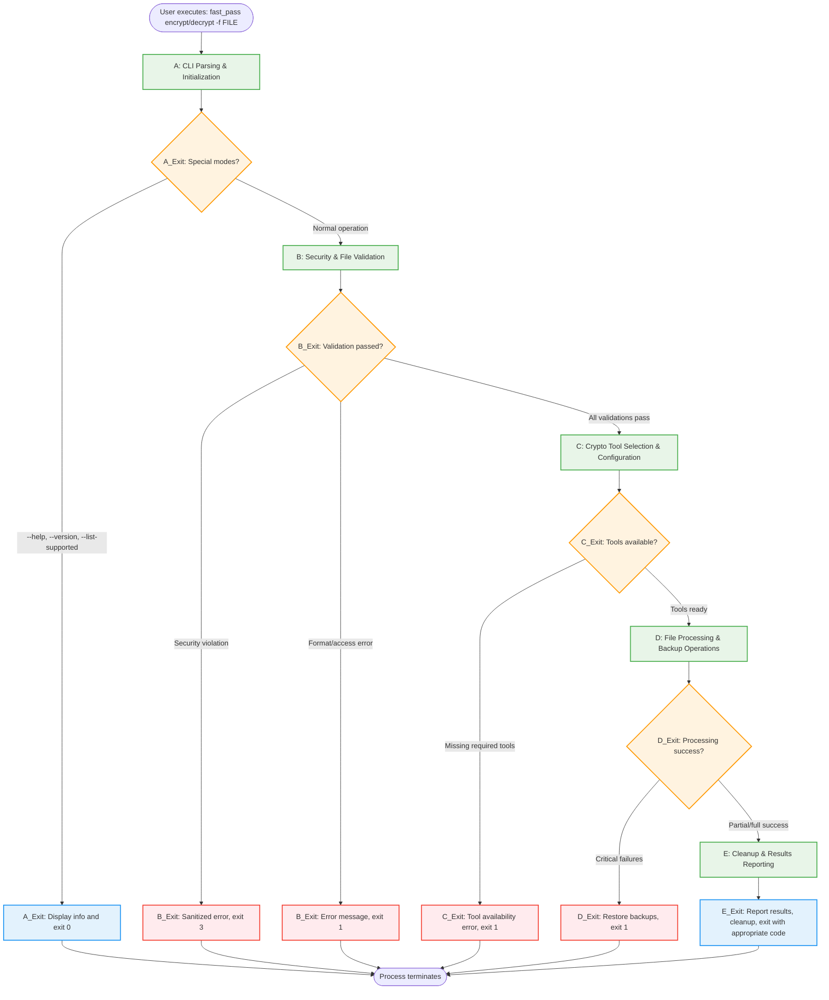

# FastPass - Complete Project Specification

> **Document Purpose & Maintenance Protocol:**
> This document serves as the authoritative, self-documenting specification for FastPass.
> It provides complete context to future AI instances and developers about:
>
> - **Current project status** and implementation details
> - **Architecture decisions** and technical solutions  
> - **Lessons learned** from development challenges
> - **Usage patterns** and deployment instructions
> - **Complete change history** and evolution of the project
>
> **Maintenance Requirement:** This document MUST be updated whenever significant changes are made to the codebase, architecture, or functionality. It should always reflect the current state of the project and serve as the single source of truth for understanding the entire system.

## Project Mission & Purpose

**FastPass** is a command-line tool that provides universal file encryption and decryption capabilities across multiple file formats. It serves as a unified front-end wrapper for specialized crypto tools (msoffcrypto-tool, PyPDF2/pikepdf, 7zip CLI) to add or remove password protection from Microsoft Office documents, PDF files, and ZIP archives.

**Core Problem Solved:** Eliminates the need to learn and manage multiple separate tools for file encryption/decryption across different formats. Provides a consistent, secure interface for password protection operations while maintaining file integrity and implementing enterprise-grade security practices.

**Key Differentiator:** Unified CLI interface with enterprise security patterns including automatic backup creation, file isolation, magic number validation, and secure password handling. Follows proven architecture patterns from the FastRedline project for reliability and security.

---

## Product Requirements Document (PRD)

### Project Overview

- **Project Name:** FastPass
- **Version:** v1.0
- **Target Platform:** Windows Desktop (CLI) with cross-platform Python support
- **Technology Stack:** Python, msoffcrypto-tool, PyPDF2/pikepdf, 7zip CLI, python-magic, pathlib
- **Timeline:** 4-6 weeks development
- **Team Size:** Single developer maintained

### Target Users

- **Primary Users:** IT administrators, security professionals, business users
- **Secondary Users:** Developers, system integrators, automation script writers
- **User Experience Level:** Intermediate (comfortable with command-line tools)
- **Use Cases:** Batch file encryption, automated security workflows, document protection, archive security

### Feature Specifications

#### Core Functionality
- [x] Universal file encryption/decryption interface
- [x] Microsoft Office document password protection (.docx, .xlsx, .pptx, .doc, .xls, .ppt)
- [x] PDF password protection and removal
- [x] ZIP archive password protection using 7zip
- [x] Batch processing for multiple files
- [x] Automatic file format detection and routing to appropriate crypto tool

#### Security & File Safety
- [x] Automatic backup creation before any modification
- [x] File format validation using magic number checking
- [x] Path traversal attack prevention
- [x] Secure temporary file creation with proper permissions (0o600)
- [x] Password memory clearing and secure handling
- [x] Error message sanitization to prevent information disclosure

#### Password Management
- [x] Command-line password input with secure handling
- [x] JSON password input via stdin for GUI integration
- [x] Interactive password prompts with hidden input
- [x] Secure random password generation
- [x] Password verification and strength validation

#### File Operations
- [x] In-place modification with automatic backup
- [x] Output directory specification for batch operations
- [x] File integrity verification after operations
- [x] Duplicate filename handling and conflict resolution
- [x] Comprehensive cleanup of temporary files

#### Utility Features
- [x] Dry-run mode for testing operations
- [x] File format support detection
- [x] Password requirement checking
- [x] Batch operation progress reporting
- [x] Detailed logging with debug mode

### Success Metrics

- **Performance Targets:** File processing < 10 seconds for typical business documents
- **User Experience:** Zero data loss, automatic backup creation, clear error messages
- **Reliability:** 99.9% successful completion rate for valid inputs
- **Security:** No password exposure in logs, secure temporary file handling

### Constraints & Assumptions

- **Technical Constraints:** Requires underlying crypto tools (msoffcrypto-tool, 7zip) to be available
- **Platform Constraints:** Some features may be Windows-specific due to 7zip CLI integration
- **Security Constraints:** Must maintain file confidentiality and integrity throughout operations
- **User Constraints:** Must have appropriate file permissions for input and output directories
- **Assumptions:** Users understand file encryption concepts and password management practices

---

## Command Line Reference

```
Usage: fast_pass [encrypt|decrypt] -f FILE [options]

Required Arguments:
  encrypt|decrypt           Operation mode: add or remove password protection
  -f, --file               Path to file to encrypt/decrypt (can be repeated for batch)

Password Options:
  -p, --password PASSWORD   Password for encryption/decryption
  -p stdin                 Read password from JSON via stdin (secure GUI integration)
  --generate-password      Generate secure random password (encryption only)
  --check-password         Check if file requires password (utility mode)

Output Options:
  -o, --output-dir DIR     Output directory (default: same as input file)
  --in-place              Modify file in-place (creates backup first)
  --backup-suffix SUFFIX  Backup file suffix (default: _backup_YYYYMMDD_HHMMSS)

Utility Options:
  --dry-run               Show what would be done without making changes
  --verify                Verify file integrity after operation
  --list-supported        List supported file formats
  --debug                 Enable detailed logging and debug output
  --version               Show version information
  --help                  Show this help message

Supported File Formats:
  Office Documents:  .docx, .xlsx, .pptx, .doc, .xls, .ppt
  PDF Files:         .pdf
  Archives:          .zip, .7z

Examples:
  # Encrypt single file with password
  fast_pass encrypt -f contract.docx -p "mypassword"
  
  # Decrypt file with password from stdin (GUI integration)
  fast_pass decrypt -f protected.pdf -p stdin < passwords.json
  
  # Encrypt with auto-generated password
  fast_pass encrypt -f document.docx --generate-password
  
  # Batch encrypt multiple files
  fast_pass encrypt -f file1.xlsx -f file2.pptx -p "shared_pwd" -o ./encrypted/
  
  # Decrypt ZIP archive with verification
  fast_pass decrypt -f archive.zip -p "zippass" --verify
  
  # Check if file requires password
  fast_pass --check-password document.pdf
  
  # Dry run to test operation
  fast_pass encrypt -f document.docx -p "test123" --dry-run

Exit Codes:
  0  Success
  1  General error (file access, crypto tool failure)
  2  Invalid arguments or command syntax
  3  Security violation (path traversal, invalid format)
  4  Password error (wrong password, authentication failure)
```

---

## High-Level Architecture Overview - Core Processing Flow

> 💡 **IMPLEMENTATION CRITICAL**: This diagram provides the master reference for code organization. Every code block must map to a specific diagram element. When implementing, label each function/method with its corresponding diagram ID (e.g., `# A1a`, `# B3c`, etc.)



---

## Section A: CLI Parsing & Initialization

> **CODE MAPPING CRITICAL**: Each element below corresponds to specific code blocks that must be labeled with the exact IDs shown (e.g., `# A1a: sys.argv processing`)

```mermaid
flowchart TD
    A1[A1: Parse command line arguments] --> A1a[A1a: Import sys, argparse, pathlib]
    A1a --> A1b[A1b: Create ArgumentParser with description]
    A1b --> A1c[A1c: Add positional encrypt/decrypt argument]
    A1c --> A1d[A1d: Add -f/--file argument with action=append]
    A1d --> A1e[A1e: Add password options -p, --generate-password]
    A1e --> A1f[A1f: Add output options -o, --in-place, --backup-suffix]
    A1f --> A1g[A1g: Add utility options --dry-run, --verify, --debug]
    A1g --> A1h[A1h: Parse sys.argv and handle parse errors]
    A1h --> A1i{A1i: Special mode check?}
    A1i -->|--help| A1_help[A1_help: Display help, sys.exit(0)]
    A1i -->|--version| A1_version[A1_version: Display version, sys.exit(0)]
    A1i -->|--list-supported| A1_list[A1_list: Display formats, sys.exit(0)]
    A1i -->|--check-password| A1_check[A1_check: Check file password, sys.exit(0/1)]
    A1i -->|Normal operation| A2
    
    A2[A2: Validate operation mode and required arguments] --> A2a[A2a: Check args.operation in encrypt/decrypt]
    A2a --> A2b[A2b: Ensure args.files list is not empty]
    A2b --> A2c[A2c: Validate conflicting options in-place + output-dir]
    A2c --> A2d[A2d: Check password requirements vs operation mode]
    A2d --> A2e{A2e: Validation passed?}
    A2e -->|No| A2_error[A2_error: Print usage error, sys.exit(2)]
    A2e -->|Yes| A3
    
    A3[A3: Setup logging and debug infrastructure] --> A3a[A3a: Import logging, datetime]
    A3a --> A3b[A3b: Configure logging.basicConfig with format]
    A3b --> A3c[A3c: Set log level based on args.debug flag]
    A3c --> A3d[A3d: Create operation_log list for history]
    A3d --> A3e[A3e: Log first entry: FastPass starting]
    A3e --> A4
    
    A4[A4: Initialize crypto tool availability detection] --> A4a[A4a: Import subprocess, shutil]
    A4a --> A4b[A4b: Test msoffcrypto-tool availability]
    A4b --> A4c[A4c: Test 7zip executable availability]
    A4c --> A4d[A4d: Test PyPDF2/pikepdf import availability]
    A4d --> A4e[A4e: Create crypto_tools availability dict]
    A4e --> A4f{A4f: Required tools missing?}
    A4f -->|Yes| A4_error[A4_error: Tool missing error, sys.exit(1)]
    A4f -->|No| A5
    
    A5[A5: Load default configuration settings] --> A5a[A5a: Create config dict with hardcoded defaults]
    A5a --> A5b[A5b: Set backup_suffix pattern with timestamp]
    A5b --> A5c[A5c: Set secure file permissions 0o600]
    A5c --> A5d[A5d: Set max_file_size limit 500MB]
    A5d --> A5e[A5e: Create supported_formats mapping dict]
    A5e --> A5f[A5f: Set cleanup and security policies]
    A5f --> A6
    
    A6[A6: Create FastPass application object] --> A6a[A6a: Initialize FastPass class instance]
    A6a --> A6b[A6b: Set operation_mode from args]
    A6b --> A6c[A6c: Initialize empty file_processors dict]
    A6c --> A6d[A6d: Create temp_files_created tracking list]
    A6d --> A6e[A6e: Create backup_files_created tracking list]
    A6e --> A6f[A6f: Record operation_start_time = datetime.now()]
    A6f --> A6g[A6g: Set state flags ready_for_processing = True]
    A6g --> SectionB[Continue to Section B: Security Validation]
    
    classDef processBox fill:#e8f5e8,stroke:#4caf50,stroke-width:2px
    classDef subProcess fill:#f3e5f5,stroke:#9c27b0,stroke-width:1px
    classDef decisionBox fill:#fff3e0,stroke:#ff9800,stroke-width:2px
    classDef exitBox fill:#ffebee,stroke:#f44336,stroke-width:2px
    
    class A1,A2,A3,A4,A5,A6 processBox
    class A1a,A1b,A1c,A1d,A1e,A1f,A1g,A1h,A2a,A2b,A2c,A2d,A3a,A3b,A3c,A3d,A3e,A4a,A4b,A4c,A4d,A4e,A5a,A5b,A5c,A5d,A5e,A5f,A6a,A6b,A6c,A6d,A6e,A6f,A6g subProcess
    class A1i,A2e,A4f decisionBox
    class A1_help,A1_version,A1_list,A1_check,A2_error,A4_error exitBox
```

**What's Actually Happening:**
- **A1: Command Line Argument Processing**
  - `sys.argv` contains raw command like `['fast_pass', 'encrypt', '-f', 'document.docx', '-p', 'password123']`
  - `argparse.ArgumentParser()` creates parser with custom action classes for file tracking
  - `args.operation` becomes `'encrypt'` or `'decrypt'` (required positional argument)
  - `args.files` becomes list of file paths like `['document.docx', 'spreadsheet.xlsx']`
  - `args.password` contains password string or `'stdin'` for JSON input
  - `args.output_dir` defaults to `None` (same directory as input files)
  - `args.debug` boolean flag for verbose logging
  - Password handling: `args.generate_password` for auto-generation mode

- **A2: Operation Mode & File Path Validation**
  - Validate operation: `args.operation in ['encrypt', 'decrypt']`
  - File existence check: `os.path.exists(file_path)` for each input file
  - Path normalization: `os.path.abspath(os.path.expanduser(file_path))`
  - Conflict detection: if `--in-place` and `--output-dir` both specified, show error
  - Build file list: `self.input_files = [{'path': normalized_path, 'exists': bool}]`
  - Special modes: `--check-password`, `--list-supported` bypass normal file requirements

- **A3: Logging System Configuration**
  - `logging.basicConfig()` with `level=logging.DEBUG` if `args.debug` enabled
  - Log format: `'%(asctime)s - %(levelname)s - %(message)s'`
  - Handler: `sys.stderr` for console output, doesn't interfere with stdout
  - First log entry: `"FastPass v1.0 starting - operation: {args.operation}"`
  - Memory logger: `self.operation_log = []` for operation history
  - Debug flag: `self.debug_mode = args.debug`

- **A4: Crypto Tool Availability Detection**
  - Test msoffcrypto-tool: `subprocess.run(['python', '-m', 'msoffcrypto.cli', '--version'])`
  - Test 7zip availability: `subprocess.run(['7z'])` or check common install paths
  - Test PyPDF2/pikepdf: `import PyPDF2; import pikepdf` with fallback handling
  - Store availability: `self.crypto_tools = {'msoffcrypto': bool, '7zip': bool, 'pdf': str}`
  - If required tools missing: log warning, may exit with helpful error message

- **A5: Configuration & Default Setup**
  - `self.config = {'backup_suffix': '_backup_{timestamp}', 'temp_dir_prefix': 'FastPass_'}`
  - `self.config['secure_permissions'] = 0o600` (read/write owner only)
  - `self.config['max_file_size'] = 500 * 1024 * 1024` (500MB limit)
  - `self.config['supported_formats'] = {'.docx': 'msoffcrypto', '.pdf': 'pypdf2', '.zip': '7zip'}`
  - Password policy: `self.config['min_password_length'] = 1` (no minimum enforced)
  - Cleanup settings: `self.config['cleanup_on_error'] = True`

- **A6: FastPass Application Object Creation**
  - Main `FastPass(args)` object instantiated with parsed arguments
  - `self.operation_mode = args.operation` ('encrypt' or 'decrypt')
  - `self.file_processors = {}` (will map files to appropriate crypto handlers)
  - `self.temp_files_created = []` (tracking for cleanup)
  - `self.backup_files_created = []` (tracking backups for rollback)
  - `self.operation_start_time = datetime.now()` for timing
  - State flags: `self.ready_for_processing = True`, `self.cleanup_required = False`

---

## Section B: Security & File Validation

> **SECURITY CRITICAL**: Every security check must map to specific code with proper error handling and sanitization. Label each implementation block with the exact ID shown.

```mermaid
flowchart TD
    B1[B1: File path resolution and normalization] --> B1a[B1a: Import os, pathlib, magic]
    B1a --> B1b[B1b: Initialize validated_files empty list]
    B1b --> B1c[B1c: Loop through each file in args.files]
    B1c --> B1d[B1d: os.path.expanduser to resolve ~ paths]
    B1d --> B1e[B1e: os.path.abspath for absolute paths]
    B1e --> B1f[B1f: os.path.normpath to clean ../ patterns]
    B1f --> B1g[B1g: pathlib.Path.resolve for canonical path]
    B1g --> B1h[B1h: Check file existence with os.path.exists]
    B1h --> B1i{B1i: File exists?}
    B1i -->|No| B1_missing[B1_missing: Add to missing_files list]
    B1i -->|Yes| B2
    B1_missing --> B1j{B1j: More files to process?}
    B1j -->|Yes| B1c
    B1j -->|No| B1_error[B1_error: Missing files error, sys.exit(2)]
    
    B2[B2: Path traversal security analysis] --> B2a[B2a: Extract path.parts for component analysis]
    B2a --> B2b[B2b: Check for dangerous patterns ../, /, \\]
    B2b --> B2c[B2c: Define forbidden paths Windows/, System32/]
    B2c --> B2d[B2d: Get allowed directories user_home, cwd]
    B2d --> B2e[B2e: Use os.path.commonpath for boundary check]
    B2e --> B2f[B2f: Verify path within allowed boundaries]
    B2f --> B2g{B2g: Security violation detected?}
    B2g -->|Yes| B2_security[B2_security: Add to security_violations list]
    B2g -->|No| B3
    B2_security --> B2h[B2h: Sanitize error message]
    B2h --> B2_exit[B2_exit: Security error, sys.exit(3)]
    
    B3[B3: File format validation using magic numbers] --> B3a[B3a: Import magic library]
    B3a --> B3b[B3b: Call magic.from_file for MIME detection]
    B3b --> B3c[B3c: Create expected_mimes mapping dict]
    B3c --> B3d[B3d: Get actual file extension from path.suffix]
    B3d --> B3e[B3e: Compare detected vs expected MIME]
    B3e --> B3f{B3f: MIME mismatch detected?}
    B3f -->|Yes| B3g[B3g: Read file signature first 8 bytes]
    B3g --> B3h[B3h: Verify magic bytes PK for Office, %PDF for PDF]
    B3h --> B3i{B3i: Magic bytes confirm mismatch?}
    B3i -->|Yes| B3_format[B3_format: Add to format_violations list]
    B3i -->|No| B4
    B3f -->|No| B4
    B3_format --> B3j[B3j: Format mismatch error, sys.exit(3)]
    
    B4[B4: File access and permission verification] --> B4a[B4a: Test file read access with open(rb)]
    B4a --> B4b[B4b: Read sample 1024 bytes for accessibility]
    B4b --> B4c[B4c: Check file size with os.path.getsize]
    B4c --> B4d[B4d: Validate size limits vs max_file_size]
    B4d --> B4e[B4e: Check empty file condition size == 0]
    B4e --> B4f[B4f: Test output directory write access if specified]
    B4f --> B4g{B4g: Access violations detected?}
    B4g -->|Yes| B4_access[B4_access: Add to access_violations list]
    B4g -->|No| B4h[B4h: Store file_metadata with size, accessibility]
    B4h --> B5
    B4_access --> B4_exit[B4_exit: Permission error, sys.exit(1)]
    
    B5[B5: Password protection status detection] --> B5a[B5a: Check file extension for crypto tool routing]
    B5a --> B5b{B5b: Office document?}
    B5b -->|Yes| B5c[B5c: Use msoffcrypto.OfficeFile to check encryption]
    B5b -->|No| B5d{B5d: PDF file?}
    B5c --> B5e[B5e: Call office_file.is_encrypted()]
    B5e --> B5f[B5f: Store encryption status in password_status dict]
    B5f --> B6
    B5d -->|Yes| B5g[B5g: Use PyPDF2.PdfReader to check encryption]
    B5d -->|No| B5h{B5h: ZIP archive?}
    B5g --> B5i[B5i: Check pdf_reader.is_encrypted property]
    B5i --> B5f
    B5h -->|Yes| B5j[B5j: Test 7zip list command for password detection]
    B5h -->|No| B5k[B5k: Unsupported format error]
    B5j --> B5f
    B5k --> B5_exit[B5_exit: Unsupported format, sys.exit(3)]
    
    B6[B6: Build validated file manifest] --> B6a[B6a: Initialize empty file_manifest list]
    B6a --> B6b[B6b: Loop through all validated files]
    B6b --> B6c[B6c: Create manifest_entry dict for each file]
    B6c --> B6d[B6d: Set path, format, size, protection status]
    B6d --> B6e[B6e: Map file extension to crypto_tool]
    B6e --> B6f[B6f: Set backup_required flag based on operation]
    B6f --> B6g[B6g: Append manifest_entry to file_manifest]
    B6g --> B6h{B6h: More files to process?}
    B6h -->|Yes| B6b
    B6h -->|No| B6i[B6i: Calculate validation summary counts]
    B6i --> B6j{B6j: Any critical errors detected?}
    B6j -->|Yes| B6_error[B6_error: Validation summary error, sys.exit(3)]
    B6j -->|No| B6k[B6k: Set validation_complete = True]
    B6k --> SectionC[Continue to Section C: Crypto Tool Selection]
    
    classDef processBox fill:#e8f5e8,stroke:#4caf50,stroke-width:2px
    classDef subProcess fill:#f3e5f5,stroke:#9c27b0,stroke-width:1px
    classDef decisionBox fill:#fff3e0,stroke:#ff9800,stroke-width:2px
    classDef exitBox fill:#ffebee,stroke:#f44336,stroke-width:2px
    classDef securityBox fill:#fce4ec,stroke:#e91e63,stroke-width:2px
    
    class B1,B2,B3,B4,B5,B6 processBox
    class B1a,B1b,B1c,B1d,B1e,B1f,B1g,B1h,B2a,B2b,B2c,B2d,B2e,B2f,B3a,B3b,B3c,B3d,B3e,B3g,B3h,B4a,B4b,B4c,B4d,B4e,B4f,B4h,B5a,B5c,B5e,B5f,B5g,B5i,B5j,B5k,B6a,B6b,B6c,B6d,B6e,B6f,B6g,B6i,B6k subProcess
    class B1i,B1j,B2g,B3f,B3i,B4g,B5b,B5d,B5h,B6h,B6j decisionBox
    class B1_missing,B1_error,B2_security,B2h,B2_exit,B3_format,B3j,B4_access,B4_exit,B5_exit,B6_error exitBox
    class B2,B3 securityBox
```

**What's Actually Happening:**
- **B1: File Path Resolution & Normalization**
  - For each file in `args.files`:
  - `os.path.expanduser()` converts `~` to actual user home directory
  - `os.path.abspath()` converts relative paths to full absolute paths
  - `os.path.normpath()` resolves `../` patterns and normalizes separators
  - `pathlib.Path(file_path).resolve()` gets canonical path resolving symlinks
  - Store in `self.validated_files = [{'original_path': str, 'resolved_path': Path, 'exists': bool}]`
  - Missing file handling: if `not path.exists()`, add to `missing_files[]` list

- **B2: Security Analysis & Path Traversal Prevention**
  - For each resolved path, extract path components: `path.parts`
  - Check for dangerous patterns: `['..', '/', '\\', 'C:\\Windows\\', 'C:\\System32\\']`
  - Validate against allowed directories: user home, current working directory, specified output dirs
  - Use `os.path.commonpath()` to ensure files within allowed boundaries
  - Path escape detection: `if not str(resolved_path).startswith(allowed_base_path):`
  - Security violation: `self.security_violations.append({'file': filename, 'violation': 'path_traversal'})`
  - If violations found: sanitize error message, `sys.exit(3)` with security error

- **B3: File Format Validation Using Magic Numbers**
  - Import `magic` library: `import magic`
  - For each file: `detected_mime = magic.from_file(str(file_path), mime=True)`
  - Expected MIME mappings:
    ```python
    expected_mimes = {
        '.docx': 'application/vnd.openxmlformats-officedocument.wordprocessingml.document',
        '.xlsx': 'application/vnd.openxmlformats-officedocument.spreadsheetml.sheet',
        '.pdf': 'application/pdf',
        '.zip': 'application/zip'
    }
    ```
  - Compare: `actual_extension = file_path.suffix.lower()`
  - Validation: `if detected_mime != expected_mimes.get(actual_extension):`
  - Read file signature: `with open(file_path, 'rb') as f: signature = f.read(8)`
  - DOCX/Office: should start with `PK` (ZIP signature: `50 4B 03 04`)
  - PDF: should start with `%PDF` (25 50 44 46)
  - Format mismatch: `self.format_violations.append({'file': filename, 'expected': expected, 'detected': detected})`

- **B4: File Access & Permission Verification**
  - Test read access: `with open(file_path, 'rb') as test: sample = test.read(1024)`
  - File size check: `file_size = os.path.getsize(file_path)`
  - Size limits: `if file_size > self.config['max_file_size']: flag as oversized`
  - Empty file check: `if file_size == 0: flag as empty`
  - Output directory write test: `os.access(output_dir, os.W_OK)` if specified
  - Permission storage: `self.file_metadata[file_path] = {'size': int, 'readable': bool, 'writable_destination': bool}`
  - Permission failures: add to `self.access_violations[]` for reporting

- **B5: Password Protection Status Detection**
  - **Office Documents**: Use msoffcrypto to check encryption
    ```python
    with open(file_path, 'rb') as f:
        office_file = msoffcrypto.OfficeFile(f)
        is_encrypted = office_file.is_encrypted()
    ```
  - **PDF Files**: Use PyPDF2 to check for password protection
    ```python
    with open(file_path, 'rb') as f:
        pdf_reader = PyPDF2.PdfReader(f)
        is_encrypted = pdf_reader.is_encrypted
    ```
  - **ZIP Archives**: Test with 7zip list command to detect password protection
  - Store status: `self.password_status[file_path] = {'currently_protected': bool, 'protection_type': str}`
  - Operation validation: if decrypt mode and not protected, log warning
  - If encrypt mode and already protected, ask for confirmation or fail

- **B6: Validated File Manifest Creation**
  - Compile validation results: `self.file_manifest = []`
  - For each file that passed all validations:
    ```python
    manifest_entry = {
        'path': Path,
        'format': str,
        'size': int,
        'currently_protected': bool,
        'crypto_tool': str,
        'backup_required': bool
    }
    ```
  - Route to crypto tools: map file extensions to handlers
  - Validation summary: `total_files = len(self.file_manifest)`
  - Error summary: `security_errors = len(self.security_violations)`
  - If any critical errors: `sys.exit(3)` with detailed error report
  - Success state: `self.validation_complete = True`

---

## Section C: Crypto Tool Selection & Configuration

> **TOOL INTEGRATION CRITICAL**: Each crypto tool handler must be implemented exactly as diagrammed. Label each handler class and method with corresponding IDs.

```mermaid
flowchart TD
    C1[C1: Analyze file formats and determine required tools] --> C1a[C1a: Loop through validated file_manifest]
    C1a --> C1b[C1b: Create tool_mapping extension dict]
    C1b --> C1c[C1c: Map .docx/.xlsx/.pptx to msoffcrypto]
    C1c --> C1d[C1d: Map .pdf to pypdf2]
    C1d --> C1e[C1e: Map .zip/.7z to 7zip]
    C1e --> C1f[C1f: Assign crypto_tool to each file entry]
    C1f --> C1g[C1g: Group files by tool into tool_groups dict]
    C1g --> C1h[C1h: Check required tools vs availability]
    C1h --> C1i{C1i: Required tools missing?}
    C1i -->|Yes| C1_error[C1_error: Tool availability error, sys.exit(1)]
    C1i -->|No| C2
    
    C2[C2: Initialize crypto tool handler classes] --> C2a[C2a: Create crypto_handlers empty dict]
    C2a --> C2b{C2b: Need msoffcrypto handler?}
    C2b -->|Yes| C2c[C2c: Initialize OfficeHandler class]
    C2b -->|No| C2d{C2d: Need PDF handler?}
    C2c --> C2e[C2e: Set OfficeHandler.tool_path]
    C2e --> C2f[C2f: Initialize OfficeHandler.temp_files list]
    C2f --> C2d
    C2d -->|Yes| C2g[C2g: Initialize PDFHandler class]
    C2d -->|No| C2h{C2h: Need ZIP handler?}
    C2g --> C2i[C2i: Check pikepdf vs PyPDF2 availability]
    C2i --> C2j[C2j: Set PDFHandler.pdf_library preference]
    C2j --> C2h
    C2h -->|Yes| C2k[C2k: Initialize ZipHandler class]
    C2h -->|No| C3
    C2k --> C2l[C2l: Find 7zip executable path]
    C2l --> C2m[C2m: Set ZipHandler.compression_level default]
    C2m --> C3
    
    C3[C3: Configure msoffcrypto tool handler] --> C3a{C3a: msoffcrypto needed?}
    C3a -->|No| C4
    C3a -->|Yes| C3b[C3b: Test subprocess msoffcrypto.cli --version]
    C3b --> C3c{C3c: Tool test successful?}
    C3c -->|No| C3_error[C3_error: msoffcrypto unavailable, sys.exit(1)]
    C3c -->|Yes| C3d[C3d: Create office_config dict]
    C3d --> C3e[C3e: Set password_method to standard]
    C3e --> C3f[C3f: Set temp_dir to temp_working_dir]
    C3f --> C3g[C3g: Set preserve_metadata to True]
    C3g --> C3h[C3h: Apply config to office_handler]
    C3h --> C3i[C3i: Store handler in crypto_handlers dict]
    C3i --> C4
    
    C4[C4: Configure PDF tool handler] --> C4a{C4a: PDF handler needed?}
    C4a -->|No| C5
    C4a -->|Yes| C4b[C4b: Try import pikepdf library]
    C4b --> C4c{C4c: pikepdf available?}
    C4c -->|Yes| C4d[C4d: Set pdf_library = pikepdf]
    C4c -->|No| C4e[C4e: Import PyPDF2 as fallback]
    C4d --> C4f[C4f: Create pdf_config dict]
    C4e --> C4f
    C4f --> C4g[C4g: Set encryption_algorithm to AES-256]
    C4g --> C4h[C4h: Define permissions dict print/modify/copy]
    C4h --> C4i[C4i: Set user_password and owner_password None]
    C4i --> C4j[C4j: Apply config to pdf_handler]
    C4j --> C4k[C4k: Store handler in crypto_handlers dict]
    C4k --> C5
    
    C5[C5: Configure 7zip CLI handler] --> C5a{C5a: ZIP handler needed?}
    C5a -->|No| C6
    C5a -->|Yes| C5b[C5b: Create zip_paths search list]
    C5b --> C5c[C5c: Loop through potential 7zip locations]
    C5c --> C5d[C5d: Test subprocess.run for each path]
    C5d --> C5e{C5e: Working 7zip found?}
    C5e -->|No| C5f{C5f: More paths to try?}
    C5f -->|Yes| C5c
    C5f -->|No| C5_error[C5_error: 7zip unavailable, sys.exit(1)]
    C5e -->|Yes| C5g[C5g: Set zip_executable to working path]
    C5g --> C5h[C5h: Create zip_config dict]
    C5h --> C5i[C5i: Set compression_method to AES256]
    C5i --> C5j[C5j: Set compression_level to 5]
    C5j --> C5k[C5k: Set solid_archive to False]
    C5k --> C5l[C5l: Initialize exclude_patterns empty list]
    C5l --> C5m[C5m: Apply config to zip_handler]
    C5m --> C5n[C5n: Store handler in crypto_handlers dict]
    C5n --> C6
    
    C6[C6: Configure tool-specific options and validation] --> C6a[C6a: Loop through each crypto_handler]
    C6a --> C6b[C6b: Set metadata preservation for Office docs]
    C6b --> C6c[C6c: Configure PDF permission settings]
    C6c --> C6d[C6d: Set ZIP compression and encryption]
    C6d --> C6e[C6e: Validate passwords meet tool requirements]
    C6e --> C6f[C6f: Configure timeout values for each tool]
    C6f --> C6g[C6g: Setup per-tool debug logging if enabled]
    C6g --> C7
    
    C7[C7: Create processing pipeline and task queue] --> C7a[C7a: Initialize processing_queue empty list]
    C7a --> C7b[C7b: Loop through file_manifest entries]
    C7b --> C7c[C7c: Create task dict for each file]
    C7c --> C7d[C7d: Set task file_path from manifest]
    C7d --> C7e[C7e: Set task operation encrypt/decrypt]
    C7e --> C7f[C7f: Assign crypto_handler from crypto_handlers]
    C7f --> C7g[C7g: Set password from args or prompt]
    C7g --> C7h[C7h: Calculate output_path based on options]
    C7h --> C7i[C7i: Generate backup_path with timestamp]
    C7i --> C7j[C7j: Initialize temp_files empty list]
    C7j --> C7k[C7k: Add completed task to processing_queue]
    C7k --> C7l{C7l: More files to process?}
    C7l -->|Yes| C7b
    C7l -->|No| C7m[C7m: Sort queue by file size for optimal processing]
    C7m --> C7n[C7n: Validate all tasks have required inputs]
    C7n --> C7o[C7o: Set pipeline_ready = True]
    C7o --> C7p[C7p: Set total_tasks = len(processing_queue)]
    C7p --> SectionD[Continue to Section D: File Processing]
    
    classDef processBox fill:#e8f5e8,stroke:#4caf50,stroke-width:2px
    classDef subProcess fill:#f3e5f5,stroke:#9c27b0,stroke-width:1px
    classDef decisionBox fill:#fff3e0,stroke:#ff9800,stroke-width:2px
    classDef exitBox fill:#ffebee,stroke:#f44336,stroke-width:2px
    classDef toolBox fill:#e1f5fe,stroke:#0277bd,stroke-width:2px
    
    class C1,C2,C3,C4,C5,C6,C7 processBox
    class C1a,C1b,C1c,C1d,C1e,C1f,C1g,C1h,C2a,C2c,C2e,C2f,C2g,C2i,C2j,C2k,C2l,C2m,C3b,C3d,C3e,C3f,C3g,C3h,C3i,C4b,C4d,C4e,C4f,C4g,C4h,C4i,C4j,C4k,C5b,C5c,C5d,C5g,C5h,C5i,C5j,C5k,C5l,C5m,C5n,C6a,C6b,C6c,C6d,C6e,C6f,C6g,C7a,C7b,C7c,C7d,C7e,C7f,C7g,C7h,C7i,C7j,C7k,C7m,C7n,C7o,C7p subProcess
    class C1i,C2b,C2d,C2h,C3a,C3c,C4a,C4c,C5a,C5e,C5f,C7l decisionBox
    class C1_error,C3_error,C5_error exitBox
    class C3,C4,C5 toolBox
```

**What's Actually Happening:**
- **C1: File Format Analysis & Tool Mapping**
  - Process validated file manifest: `for file_entry in self.file_manifest:`
  - Extension-to-tool mapping:
    ```python
    tool_mapping = {
        '.docx': 'msoffcrypto', '.xlsx': 'msoffcrypto', '.pptx': 'msoffcrypto',
        '.doc': 'msoffcrypto', '.xls': 'msoffcrypto', '.ppt': 'msoffcrypto',
        '.pdf': 'pypdf2',
        '.zip': '7zip', '.7z': '7zip'
    }
    ```
  - Assign crypto tool: `file_entry['crypto_tool'] = tool_mapping[file_entry['extension']]`
  - Group by tool: `self.tool_groups = {'msoffcrypto': [], 'pypdf2': [], '7zip': []}`
  - Availability check: ensure required tools are available for file types present
  - If tool missing: `sys.exit(1)` with "Required crypto tool not available: {tool_name}"

- **C2: Crypto Tool Handler Initialization**
  - **msoffcrypto Handler**:
    ```python
    class OfficeHandler:
        def __init__(self):
            self.tool_path = 'python -m msoffcrypto.cli'
            self.temp_files = []
        
        def encrypt(self, input_path, output_path, password):
            # Implementation using msoffcrypto
        
        def decrypt(self, input_path, output_path, password):
            # Implementation using msoffcrypto
    ```
  - **PyPDF2 Handler**:
    ```python
    class PDFHandler:
        def __init__(self):
            self.use_pikepdf = self._check_pikepdf_availability()
        
        def encrypt(self, input_path, output_path, password):
            # Implementation using PyPDF2 or pikepdf
    ```
  - **7zip Handler**:
    ```python
    class ZipHandler:
        def __init__(self):
            self.zip_path = self._find_7zip_executable()
            self.compression_level = 5
    ```

- **C4: msoffcrypto-tool Configuration**
  - Test tool availability: `subprocess.run(['python', '-m', 'msoffcrypto.cli', '--version'])`
  - Configure encryption options:
    ```python
    office_config = {
        'password_method': 'standard',  # Use standard Office encryption
        'temp_dir': self.temp_working_dir,
        'preserve_metadata': True
    }
    ```
  - Set handler methods: `self.office_handler.set_config(office_config)`
  - Store in pipeline: `self.crypto_handlers['msoffcrypto'] = office_handler`

- **C5: PyPDF2/pikepdf Configuration** 
  - Detect available PDF library:
    ```python
    try:
        import pikepdf
        self.pdf_library = 'pikepdf'  # Preferred for better encryption
    except ImportError:
        import PyPDF2
        self.pdf_library = 'pypdf2'
    ```
  - Configure PDF encryption settings:
    ```python
    pdf_config = {
        'encryption_algorithm': 'AES-256',
        'permissions': {'print': True, 'modify': False, 'copy': True},
        'user_password': None,  # Will be set per operation
        'owner_password': None  # Same as user password by default
    }
    ```

- **C6: 7zip CLI Configuration**
  - Locate 7zip executable:
    ```python
    zip_paths = ['7z', 'C:\\Program Files\\7-Zip\\7z.exe', 'C:\\Program Files (x86)\\7-Zip\\7z.exe']
    for path in zip_paths:
        if subprocess.run([path], capture_output=True).returncode != 1:  # 1 = no args, but tool works
            self.zip_executable = path
            break
    ```
  - Configure 7zip options:
    ```python
    zip_config = {
        'compression_method': 'AES256',  # Strong encryption
        'compression_level': 5,         # Balanced speed/size
        'solid_archive': False,         # Better for individual file access
        'exclude_patterns': []          # No exclusions by default
    }
    ```

- **C7: Tool-Specific Option Configuration**
  - **Office Documents**: Set metadata preservation, compatible encryption methods
  - **PDF Files**: Configure user/owner passwords, permission settings
  - **ZIP Archives**: Set compression level, encryption method, file patterns
  - Password validation: ensure passwords meet tool-specific requirements
  - Error handling: configure timeout values, retry attempts for each tool
  - Logging: set up per-tool debug logging if enabled

- **C8: Processing Pipeline Creation**
  - Build processing queue: `self.processing_queue = []`
  - For each file, create processing task:
    ```python
    task = {
        'file_path': Path,
        'operation': 'encrypt' | 'decrypt',
        'crypto_handler': handler_object,
        'password': str,
        'output_path': Path,
        'backup_path': Path,
        'temp_files': []
    }
    ```
  - Sort by file size: process smaller files first for faster feedback
  - Dependency resolution: if files depend on each other, order appropriately
  - Pipeline validation: ensure all tasks have required inputs and handlers
  - Ready state: `self.pipeline_ready = True`, `self.total_tasks = len(processing_queue)`

---

## Section D: File Processing & Backup Operations

> **CRYPTO OPERATIONS CRITICAL**: Each crypto tool operation must be implemented with exact error handling. Every processing step must map to specific code labeled with IDs below.

```mermaid
flowchart TD
    D1[D1: Create secure temporary working directory] --> D1a[D1a: Import tempfile, datetime, os]
    D1a --> D1b[D1b: Generate unique temp dir name with timestamp and PID]
    D1b --> D1c[D1c: Call tempfile.mkdtemp with FastPass prefix]
    D1c --> D1d[D1d: Set directory permissions to 0o700 owner only]
    D1d --> D1e[D1e: Add temp_working_dir to cleanup_registry]
    D1e --> D1f[D1f: Create subdirectories backups/, processing/, output/]
    D1f --> D1g[D1g: Log temp directory creation with path]
    D1g --> D2
    
    D2[D2: Generate backup files for all input files] --> D2a[D2a: Initialize backup_files empty dict]
    D2a --> D2b[D2b: Loop through each file in processing_queue]
    D2b --> D2c[D2c: Generate timestamp for backup filename]
    D2c --> D2d[D2d: Create backup_name with _backup_timestamp pattern]
    D2d --> D2e[D2e: Set backup_path in temp_working_dir/backups/]
    D2e --> D2f[D2f: Use shutil.copy2 to preserve metadata]
    D2f --> D2g[D2g: Verify backup file size matches original]
    D2g --> D2h{D2h: Backup creation successful?}
    D2h -->|No| D2_error[D2_error: Backup failed, sys.exit(1)]
    D2h -->|Yes| D2i[D2i: Set backup permissions to 0o600]
    D2i --> D2j[D2j: Store backup info in backup_files dict]
    D2j --> D2k{D2k: More files to backup?}
    D2k -->|Yes| D2b
    D2k -->|No| D3
    
    D3[D3: Process each file through appropriate crypto pipeline] --> D3a[D3a: Loop through processing_queue tasks]
    D3a --> D3b{D3b: What crypto tool for this file?}
    D3b -->|msoffcrypto| D3c[D3c: Office document processing branch]
    D3b -->|pypdf2| D3d[D3d: PDF processing branch]
    D3b -->|7zip| D3e[D3e: ZIP archive processing branch]
    
    D3c --> D3c1[D3c1: Open file with open(rb) mode]
    D3c1 --> D3c2[D3c2: Create msoffcrypto.OfficeFile object]
    D3c2 --> D3c3{D3c3: Operation is decrypt?}
    D3c3 -->|Yes| D3c4[D3c4: Call office_file.load_key with password]
    D3c3 -->|No| D3c8[D3c8: Encrypt operation branch]
    D3c4 --> D3c5[D3c5: Open temp output file in wb mode]
    D3c5 --> D3c6[D3c6: Call office_file.decrypt to output]
    D3c6 --> D3c7[D3c7: Close input and output files]
    D3c7 --> D4
    D3c8 --> D3c9[D3c9: Call office_file.encrypt with password]
    D3c9 --> D3c10[D3c10: Write encrypted output to temp file]
    D3c10 --> D3c7
    
    D3d --> D3d1{D3d1: Using pikepdf library?}
    D3d1 -->|Yes| D3d2[D3d2: Import pikepdf, use pikepdf.open]
    D3d1 -->|No| D3d6[D3d6: Import PyPDF2, use PdfReader]
    D3d2 --> D3d3{D3d3: Operation is decrypt?}
    D3d3 -->|Yes| D3d4[D3d4: Open with password parameter]
    D3d3 -->|No| D3d5[D3d5: Save with encryption parameter]
    D3d4 --> D3d10[D3d10: Save decrypted to temp output]
    D3d5 --> D3d11[D3d11: Apply pikepdf.Encryption with password]
    D3d6 --> D3d7{D3d7: Operation is decrypt?}
    D3d7 -->|Yes| D3d8[D3d8: Check is_encrypted, decrypt with password]
    D3d7 -->|No| D3d9[D3d9: Use PdfWriter to encrypt with password]
    D3d8 --> D3d10
    D3d9 --> D3d11
    D3d10 --> D4
    D3d11 --> D4
    
    D3e --> D3e1{D3e1: Operation is decrypt?}
    D3e1 -->|Yes| D3e2[D3e2: Build 7z extract command with password]
    D3e1 -->|No| D3e6[D3e6: Build 7z archive command with password]
    D3e2 --> D3e3[D3e3: Set command: 7z x file -pPASSWORD -oOUTPUT]
    D3e3 --> D3e4[D3e4: Execute subprocess.run with capture_output]
    D3e4 --> D3e5[D3e5: Check subprocess return code]
    D3e5 --> D3e9
    D3e6 --> D3e7[D3e7: Set command: 7z a -pPASSWORD output input]
    D3e7 --> D3e8[D3e8: Execute subprocess.run with capture_output]
    D3e8 --> D3e5
    D3e9 --> D4
    
    D4[D4: Validate processing success for each operation] --> D4a[D4a: Check subprocess return codes != 0]
    D4a --> D4b[D4b: Verify temp output file exists]
    D4b --> D4c[D4c: Check output file size > 0 and reasonable]
    D4c --> D4d[D4d: Run magic number check on output file]
    D4d --> D4e{D4e: All validations passed?}
    D4e -->|No| D4f[D4f: Log detailed error information]
    D4f --> D4g[D4g: Add file to processing_errors list]
    D4g --> D6
    D4e -->|Yes| D4h[D4h: Add file to successful_operations list]
    D4h --> D5
    
    D5[D5: Verify file integrity and accessibility] --> D5a[D5a: Run magic number check on processed file]
    D5a --> D5b{D5b: Office document?}
    D5b -->|Yes| D5c[D5c: Test with python-docx or openpyxl basic structure]
    D5b -->|No| D5d{D5d: PDF file?}
    D5c --> D5f
    D5d -->|Yes| D5e[D5e: Test with PyPDF2 for readable PDF structure]
    D5d -->|No| D5g{D5g: ZIP archive?}
    D5e --> D5f
    D5g -->|Yes| D5h[D5h: Test with 7zip list command for integrity]
    D5g -->|No| D5f
    D5h --> D5f
    D5f --> D5i{D5i: Operation was encrypt?}
    D5i -->|Yes| D5j[D5j: Test that password is now required]
    D5i -->|No| D5k[D5k: Test that file opens without password]
    D5j --> D5l[D5l: Store verification results in dict]
    D5k --> D5l
    D5l --> D5m{D5m: Verification successful?}
    D5m -->|No| D6
    D5m -->|Yes| D7
    
    D6[D6: Handle processing errors and restore from backup] --> D6a[D6a: Restore original from backup using shutil.copy2]
    D6a --> D6b[D6b: Preserve original timestamps with copy2]
    D6b --> D6c[D6c: Remove any partial temp outputs created]
    D6c --> D6d[D6d: Collect detailed error information for reporting]
    D6d --> D6e[D6e: Log restoration with filename]
    D6e --> D6f{D6f: Continue with next file or exit?}
    D6f -->|Continue| D6g{D6g: More files in queue?}
    D6f -->|Exit| D8
    D6g -->|Yes| D3a
    D6g -->|No| D8
    
    D7[D7: Move processed files to final destination] --> D7a{D7a: In-place modification requested?}
    D7a -->|Yes| D7b[D7b: Set final_path = original_file_path]
    D7a -->|No| D7c{D7c: Output directory specified?}
    D7b --> D7e
    D7c -->|Yes| D7d[D7d: Set final_path = output_dir / processed_filename]
    D7c -->|No| D7f[D7f: Set final_path = original_parent / processed_filename]
    D7d --> D7e
    D7f --> D7e
    D7e --> D7g{D7g: Final path already exists?}
    D7g -->|Yes| D7h[D7h: Append counter _001, _002 etc to filename]
    D7g -->|No| D7i[D7i: Use calculated final_path as-is]
    D7h --> D7i
    D7i --> D7j[D7j: Move from temp to final using shutil.move]
    D7j --> D7k[D7k: Update output_files tracking list]
    D7k --> D9
    
    D8[D8: Handle critical errors and prepare for exit] --> D8a[D8a: Clean up temp working directory with rmtree]
    D8a --> D8b[D8b: Restore all files from backups if requested]
    D8b --> D8c[D8c: Generate comprehensive error report]
    D8c --> D8d[D8d: Set exit code to 1 for processing errors]
    D8d --> D8_exit[D8_exit: sys.exit(1)]
    
    D9[D9: Update file permissions and metadata] --> D9a[D9a: Set output file permissions to 0o644 or 0o600]
    D9a --> D9b[D9b: Preserve original timestamps where appropriate]
    D9b --> D9c[D9c: Update file metadata creation/modification times]
    D9c --> D9d[D9d: Generate file checksums using hashlib.sha256]
    D9d --> D9e[D9e: Store final metadata in final_file_metadata dict]
    D9e --> SectionE[Continue to Section E: Cleanup & Results]
    
    classDef processBox fill:#e8f5e8,stroke:#4caf50,stroke-width:2px
    classDef subProcess fill:#f3e5f5,stroke:#9c27b0,stroke-width:1px
    classDef decisionBox fill:#fff3e0,stroke:#ff9800,stroke-width:2px
    classDef exitBox fill:#ffebee,stroke:#f44336,stroke-width:2px
    classDef cryptoBox fill:#fff8e1,stroke:#f57c00,stroke-width:2px
    
    class D1,D2,D3,D4,D5,D6,D7,D8,D9 processBox
    class D1a,D1b,D1c,D1d,D1e,D1f,D1g,D2a,D2b,D2c,D2d,D2e,D2f,D2g,D2i,D2j,D3a,D3c1,D3c2,D3c4,D3c5,D3c6,D3c7,D3c8,D3c9,D3c10,D3d2,D3d4,D3d5,D3d6,D3d8,D3d9,D3d10,D3d11,D3e2,D3e3,D3e4,D3e5,D3e6,D3e7,D3e8,D3e9,D4a,D4b,D4c,D4d,D4f,D4g,D4h,D5a,D5c,D5e,D5h,D5j,D5k,D5l,D6a,D6b,D6c,D6d,D6e,D7b,D7d,D7f,D7h,D7i,D7j,D7k,D8a,D8b,D8c,D8d,D9a,D9b,D9c,D9d,D9e subProcess
    class D2h,D2k,D3b,D3c3,D3d1,D3d3,D3d7,D3e1,D4e,D5b,D5d,D5g,D5i,D5m,D6f,D6g,D7a,D7c,D7g decisionBox
    class D2_error,D8_exit exitBox
    class D3c,D3d,D3e cryptoBox
```

**What's Actually Happening:**
- **D1: Secure Temporary Directory Setup**
  - Create session temp directory: 
    ```python
    import tempfile
    self.temp_working_dir = Path(tempfile.mkdtemp(
        prefix='FastPass_', 
        suffix=f'_{datetime.now().strftime("%Y%m%d_%H%M%S")}_{os.getpid()}'
    ))
    ```
  - Set secure permissions: `os.chmod(self.temp_working_dir, 0o700)` (owner access only)
  - Register for cleanup: `self.cleanup_registry.append(self.temp_working_dir)`
  - Create subdirectories: `backups/`, `processing/`, `output/` within temp directory
  - Log creation: `"Created secure temp directory: {self.temp_working_dir}"`

- **D2: Backup File Creation**
  - For each file in processing queue:
  - Generate backup filename: 
    ```python
    timestamp = datetime.now().strftime('%Y%m%d_%H%M%S')
    backup_name = f"{file_path.stem}_backup_{timestamp}{file_path.suffix}"
    backup_path = self.temp_working_dir / 'backups' / backup_name
    ```
  - Create backup: `shutil.copy2(file_path, backup_path)` (preserves metadata)
  - Verify backup: check file size matches, basic accessibility test
  - Set backup permissions: `os.chmod(backup_path, 0o600)` (read/write owner only)
  - Store backup info: `self.backup_files[file_path] = {'backup_path': backup_path, 'created': datetime.now()}`
  - If backup fails: `sys.exit(1)` with "Failed to create backup for: {filename}"

- **D3: Crypto Processing Pipeline Execution**
  - **Office Document Processing (msoffcrypto)**:
    ```python
    def process_office_file(self, file_path, operation, password):
        with open(file_path, 'rb') as input_file:
            office_file = msoffcrypto.OfficeFile(input_file)
            if operation == 'decrypt':
                office_file.load_key(password=password)
                with open(temp_output, 'wb') as output_file:
                    office_file.decrypt(output_file)
            elif operation == 'encrypt':
                # Use msoffcrypto encrypt functionality
                office_file.encrypt(password=password, output_file=temp_output)
    ```
  
  - **PDF Processing (PyPDF2/pikepdf)**:
    ```python
    def process_pdf_file(self, file_path, operation, password):
        if self.pdf_library == 'pikepdf':
            import pikepdf
            if operation == 'decrypt':
                with pikepdf.open(file_path, password=password) as pdf:
                    pdf.save(temp_output)
            elif operation == 'encrypt':
                with pikepdf.open(file_path) as pdf:
                    pdf.save(temp_output, encryption=pikepdf.Encryption(
                        user=password, owner=password))
    ```
  
  - **ZIP Processing (7zip CLI)**:
    ```python
    def process_zip_file(self, file_path, operation, password):
        if operation == 'decrypt':
            cmd = [self.zip_executable, 'x', str(file_path), f'-p{password}', f'-o{temp_output_dir}']
        elif operation == 'encrypt':
            cmd = [self.zip_executable, 'a', f'-p{password}', str(temp_output), str(file_path)]
        result = subprocess.run(cmd, capture_output=True, text=True)
        if result.returncode != 0:
            raise CryptoProcessingError(f"7zip error: {result.stderr}")
    ```

- **D4: Processing Success Validation**
  - Check subprocess return codes: `if result.returncode != 0:`
  - Verify output file creation: `if not temp_output_path.exists():`
  - Basic file size validation: ensure output file has reasonable size (> 0, not suspiciously different)
  - Format validation: run magic number check on output to ensure proper format
  - If any validation fails: log error details, increment `self.processing_errors`
  - Success tracking: `self.successful_operations.append(file_path)`

- **D5: File Integrity & Accessibility Verification**  
  - **Format verification**: Run magic number check on processed file
  - **Accessibility test**: Try to open file with appropriate tool/library
  - **Office documents**: Test with `python-docx` or `openpyxl` for basic structure
  - **PDF files**: Test with PyPDF2 to ensure readable PDF structure
  - **ZIP archives**: Test with 7zip list command to verify archive integrity
  - **Password verification**: For encrypt operations, test that password is required
  - **For decrypt operations**: Test that file opens without password
  - Store verification results: `self.verification_results[file_path] = {'format_ok': bool, 'accessible': bool, 'password_status_correct': bool}`

- **D6: Error Handling & Backup Restoration**
  - If processing fails: restore original from backup
  - Restoration process: `shutil.copy2(backup_path, original_path)`
  - Preserve original timestamps: use `shutil.copy2` to maintain metadata
  - Clean up partial outputs: remove any temporary files created during failed processing
  - Error reporting: collect detailed error information for user
  - Log restoration: `"Restored {filename} from backup due to processing failure"`
  - Continue with next file or exit based on error severity

- **D7: Final File Placement & Conflict Resolution**
  - Determine final output location:
    ```python
    if args.in_place:
        final_path = original_file_path
    elif args.output_dir:
        final_path = Path(args.output_dir) / processed_file_name
    else:
        final_path = original_file_path.parent / processed_file_name
    ```
  - Handle filename conflicts: if file exists, append counter `_001`, `_002`, etc.
  - Move from temp to final: `shutil.move(temp_processed_file, final_path)`
  - Update file tracking: `self.output_files.append({'original': original_path, 'final': final_path})`

- **D8: Error Exit & Cleanup**
  - If critical errors occurred: prepare for early exit
  - Cleanup temp files: `shutil.rmtree(self.temp_working_dir, ignore_errors=True)`
  - Restore all files from backups if requested
  - Generate error report: summarize what failed and why
  - Set exit code: `sys.exit(1)` for processing errors

- **D9: File Permissions & Metadata Finalization**
  - Set appropriate permissions on output files: `os.chmod(output_file, 0o644)` (readable by all, writable by owner)
  - Preserve original timestamps where appropriate
  - Update file metadata: creation time, modification time based on operation type
  - For encrypted files: may want to set more restrictive permissions `0o600`
  - Generate file checksums: `hashlib.sha256()` for integrity verification
  - Store final metadata: `self.final_file_metadata[output_path] = {'size': int, 'checksum': str, 'permissions': oct}`

---

## Section E: Cleanup & Results Reporting

> **CLEANUP & SECURITY CRITICAL**: Memory cleanup and proper exit codes are essential for security. Every cleanup operation must be implemented with corresponding ID labels.

```mermaid
flowchart TD
    E1[E1: Summarize processing results and calculate metrics] --> E1a[E1a: Calculate total files processed count]
    E1a --> E1b[E1b: Count successful_operations length]
    E1b --> E1c[E1c: Count processing_errors length]
    E1c --> E1d[E1d: Count skipped_files length]
    E1d --> E1e[E1e: Calculate operation duration from start_time]
    E1e --> E1f[E1f: Create summary dict with all counts]
    E1f --> E1g[E1g: Categorize results by operation type and format]
    E1g --> E1h[E1h: Calculate file size changes original vs processed]
    E1h --> E1i[E1i: Generate performance metrics files/second]
    E1i --> E1j[E1j: Group errors by type password/format/permission]
    E1j --> E2
    
    E2[E2: Cleanup temporary files and directories] --> E2a[E2a: Try shutil.rmtree on temp_working_dir]
    E2a --> E2b{E2b: Cleanup successful?}
    E2b -->|No| E2c[E2c: Log warning about cleanup failure]
    E2b -->|Yes| E2d[E2d: Log debug message temp directory cleaned]
    E2c --> E2e[E2e: Loop through temp_files_created list]
    E2d --> E2e
    E2e --> E2f[E2f: Remove individual temp files if exist]
    E2f --> E2g[E2g: Call cleanup methods on crypto tool handlers]
    E2g --> E2h[E2h: Verify temp directories no longer exist]
    E2h --> E2i[E2i: Calculate disk space freed by cleanup]
    E2i --> E2j[E2j: Log cleanup results with counts and size]
    E2j --> E3
    
    E3[E3: Generate comprehensive operation report] --> E3a{E3a: All operations successful?}
    E3a -->|Yes| E3b[E3b: Generate success report format]
    E3a -->|No| E3c[E3c: Generate error report format]
    E3b --> E3d[E3d: Format: FastPass Operation Complete header]
    E3c --> E3e[E3e: Format: FastPass Operation Completed with Errors]
    E3d --> E3f[E3f: Add operation type encrypt/decrypt]
    E3e --> E3f
    E3f --> E3g[E3g: Add files processed count successful/total]
    E3g --> E3h[E3h: Add output location directory path]
    E3h --> E3i[E3i: Add total processing time duration]
    E3i --> E3j[E3j: List successful files with checkmark]
    E3j --> E3k{E3k: Any failures occurred?}
    E3k -->|Yes| E3l[E3l: List failed files with X mark and reasons]
    E3k -->|No| E3m[E3m: Include file locations and sizes]
    E3l --> E3m
    E3m --> E3n[E3n: Add backup locations if failures occurred]
    E3n --> E3o[E3o: Provide next steps or troubleshooting guidance]
    E3o --> E4
    
    E4[E4: Handle backup file retention and cleanup policy] --> E4a{E4a: All operations successful?}
    E4a -->|Yes| E4b{E4b: Keep backups requested?}
    E4a -->|No| E4j[E4j: Keep backups for failed operations]
    E4b -->|No| E4c[E4c: Loop through backup_files values]
    E4b -->|Yes| E4i[E4i: Keep all backups, inform user of location]
    E4c --> E4d[E4d: Call unlink() on each backup_path]
    E4d --> E4e[E4e: Remove backup from backup_files dict]
    E4e --> E4f{E4f: More backups to remove?}
    E4f -->|Yes| E4c
    E4f -->|No| E4g[E4g: Log backup cleanup completion]
    E4g --> E4h[E4h: Set backup retention policy 7 days auto-cleanup]
    E4h --> E4k
    E4i --> E4k
    E4j --> E4k[E4k: Generate backup manifest with timestamps]
    E4k --> E4l[E4l: Log backup status with count and location]
    E4l --> E5
    
    E5[E5: Clear sensitive data from memory securely] --> E5a{E5a: Passwords stored in memory?}
    E5a -->|Yes| E5b[E5b: Loop through passwords list/dict]
    E5a -->|No| E5f[E5f: Clear password-related data structures]
    E5b --> E5c[E5c: Overwrite each password with X characters]
    E5c --> E5d[E5d: Delete password variables with del]
    E5d --> E5e{E5e: More passwords to clear?}
    E5e -->|Yes| E5b
    E5e -->|No| E5f
    E5f --> E5g[E5g: Force garbage collection with gc.collect()]
    E5g --> E5h[E5h: Clear command-line arg references with passwords]
    E5h --> E5i[E5i: Log security cleanup completion]
    E5i --> E6
    
    E6[E6: Determine appropriate exit code based on results] --> E6a[E6a: Check processing_errors list length]
    E6a --> E6b[E6b: Check successful_operations list length]
    E6b --> E6c{E6c: Zero errors and >0 successful?}
    E6c -->|Yes| E6d[E6d: Set exit_code = 0]
    E6c -->|No| E6e{E6e: Processing errors occurred?}
    E6d --> E6l[E6l: Set exit_reason = All operations successful]
    E6e -->|Yes| E6f[E6f: Set exit_code = 1]
    E6e -->|No| E6g{E6g: Security violations occurred?}
    E6f --> E6m[E6m: Set exit_reason = Processing failures]
    E6g -->|Yes| E6h[E6h: Set exit_code = 3]
    E6g -->|No| E6i{E6i: Authentication errors occurred?}
    E6h --> E6n[E6n: Set exit_reason = Security violations]
    E6i -->|Yes| E6j[E6j: Set exit_code = 4]
    E6i -->|No| E6k[E6k: Set exit_code = 2]
    E6j --> E6o[E6o: Set exit_reason = Authentication failures]
    E6k --> E6p[E6p: Set exit_reason = Invalid arguments]
    E6l --> E7
    E6m --> E7
    E6n --> E7
    E6o --> E7
    E6p --> E7
    
    E7[E7: Evaluate overall operation success and branch] --> E7a{E7a: exit_code == 0?}
    E7a -->|Yes| E7b[E7b: Log info: Operation completed successfully]
    E7a -->|No| E7c[E7c: Log error: Operation completed with errors]
    E7b --> E7d[E7d: Console output: checkmark All files processed successfully]
    E7c --> E7e[E7e: Console output: warning Operation completed with N errors]
    E7d --> E8
    E7e --> E9
    
    E8[E8: Handle successful exit with positive messaging] --> E8a[E8a: Display success message with summary stats]
    E8a --> E8b[E8b: Show output file locations and paths]
    E8b --> E8c{E8c: Generated passwords used?}
    E8c -->|Yes| E8d[E8d: Display generated passwords securely]
    E8c -->|No| E8e[E8e: Provide usage tips or next steps]
    E8d --> E8e
    E8e --> E8f[E8f: Final log entry: FastPass completed successfully]
    E8f --> E8g[E8g: sys.exit(0)]
    
    E9[E9: Handle error exit with troubleshooting guidance] --> E9a[E9a: Display error summary with specific failure details]
    E9a --> E9b[E9b: Show troubleshooting guidance based on error types]
    E9b --> E9c[E9c: Indicate backup file locations for recovery]
    E9c --> E9d[E9d: Suggest command corrections if applicable]
    E9d --> E9e[E9e: Final log entry: FastPass completed with errors code]
    E9e --> E9f[E9f: sys.exit(exit_code)]
    
    classDef processBox fill:#e8f5e8,stroke:#4caf50,stroke-width:2px
    classDef subProcess fill:#f3e5f5,stroke:#9c27b0,stroke-width:1px
    classDef decisionBox fill:#fff3e0,stroke:#ff9800,stroke-width:2px
    classDef exitBox fill:#ffebee,stroke:#f44336,stroke-width:2px
    classDef successBox fill:#e3f2fd,stroke:#2196f3,stroke-width:2px
    classDef securityBox fill:#fce4ec,stroke:#e91e63,stroke-width:2px
    
    class E1,E2,E3,E4,E6,E7 processBox
    class E1a,E1b,E1c,E1d,E1e,E1f,E1g,E1h,E1i,E1j,E2a,E2c,E2d,E2e,E2f,E2g,E2h,E2i,E2j,E3d,E3e,E3f,E3g,E3h,E3i,E3j,E3l,E3m,E3n,E3o,E4c,E4d,E4e,E4g,E4h,E4i,E4j,E4k,E4l,E5b,E5c,E5d,E5f,E5g,E5h,E5i,E6a,E6b,E6d,E6f,E6h,E6j,E6k,E6l,E6m,E6n,E6o,E6p,E7b,E7c,E7d,E7e,E8a,E8b,E8d,E8e,E8f,E9a,E9b,E9c,E9d,E9e subProcess
    class E2b,E3a,E3k,E4a,E4b,E4f,E5a,E5e,E6c,E6e,E6g,E6i,E7a,E8c decisionBox
    class E8g,E9f exitBox
    class E8 successBox
    class E5 securityBox
```

**What's Actually Happening:**
- **E1: Operation Results Summarization**
  - Calculate success metrics:
    ```python
    summary = {
        'total_files': len(self.file_manifest),
        'successful': len(self.successful_operations),
        'failed': len(self.processing_errors),
        'skipped': len(self.skipped_files),
        'operation_duration': (datetime.now() - self.operation_start_time).total_seconds()
    }
    ```
  - Categorize results by operation type and file format
  - Track file size changes: compare original vs processed file sizes
  - Generate performance metrics: files per second, average processing time
  - Error categorization: group errors by type (password, format, permission, etc.)

- **E2: Temporary File & Directory Cleanup**
  - Clean up temp working directory:
    ```python
    try:
        shutil.rmtree(self.temp_working_dir)
        self.log_debug(f"Cleaned up temp directory: {self.temp_working_dir}")
    except Exception as e:
        self.log_warning(f"Failed to cleanup temp directory: {e}")
    ```
  - Remove individual temp files tracked: `for temp_file in self.temp_files_created:`
  - Clear crypto tool temporary files: call cleanup methods on handlers
  - Verify cleanup completion: check that temp directories no longer exist
  - Free disk space calculation: measure space freed by cleanup
  - Log cleanup results: "Cleanup completed: {count} files removed, {size}MB freed"

- **E3: Operation Report Generation**
  - **Success Report**:
    ```
    FastPass Operation Complete
    ===========================
    Operation: encrypt
    Files processed: 5/5 successful
    Output location: ./encrypted/
    Total time: 23.4 seconds
    
    Files:
      ✓ document.docx → document_encrypted.docx
      ✓ spreadsheet.xlsx → spreadsheet_encrypted.xlsx
      ✓ presentation.pptx → presentation_encrypted.pptx
    ```
  - **Error Report**:
    ```
    FastPass Operation Completed with Errors
    ========================================
    Files processed: 2/5 successful, 3 failed
    
    Successful:
      ✓ document.docx
      ✓ spreadsheet.xlsx
    
    Failed:
      ✗ protected.pdf - Wrong password
      ✗ corrupt.docx - File format error
      ✗ readonly.xlsx - Permission denied
    ```
  - Include file locations, sizes, processing times
  - Show backup locations if failures occurred
  - Provide next steps or troubleshooting guidance

- **E4: Backup File Management**
  - **Success case**: Remove backups if processing successful and not requested to keep
    ```python
    if not args.keep_backups and all_operations_successful:
        for backup_path in self.backup_files.values():
            backup_path['backup_path'].unlink()
    ```
  - **Failure case**: Keep backups and inform user of location
  - **Partial success**: Keep backups only for failed operations
  - Backup retention policy: auto-cleanup after 7 days unless `--keep-backups` specified
  - Generate backup manifest: list of all backups created with timestamps
  - Log backup status: "Backups retained: {count} files in {location}"

- **E5: Sensitive Data Memory Cleanup**
  - Clear password variables:
    ```python
    if hasattr(self, 'passwords'):
        for pwd in self.passwords:
            # Overwrite memory (Python limitation, best effort)
            pwd = 'X' * len(pwd)
        del self.passwords
    ```
  - Clear password-related data structures
  - Force garbage collection: `import gc; gc.collect()`
  - Clear command-line argument references that might contain passwords
  - Log security cleanup: "Sensitive data cleared from memory"

- **E6: Exit Code Determination**
  - **Exit Code 0**: All operations successful, no errors
    ```python
    if len(self.processing_errors) == 0 and len(self.successful_operations) > 0:
        return 0
    ```
  - **Exit Code 1**: Processing errors (file access, crypto tool failures, wrong passwords)
  - **Exit Code 2**: Invalid command-line arguments or usage errors  
  - **Exit Code 3**: Security violations (path traversal, format validation failures)
  - **Exit Code 4**: Authentication errors (wrong passwords, access denied)
  - Mixed results: return non-zero if any failures occurred
  - Store exit reason: `self.exit_reason = "3 files failed processing"`

- **E7: Success/Failure Branch Logic**
  - Evaluate overall operation success:
    ```python
    if self.exit_code == 0:
        self.log_info("Operation completed successfully")
        self.console_output("✓ All files processed successfully")
    else:
        self.log_error(f"Operation completed with errors: {self.exit_reason}")
        self.console_output(f"⚠ Operation completed with {len(self.processing_errors)} errors")
    ```

- **E8: Successful Exit Handling**
  - Display success message with summary
  - Show output file locations
  - Display any generated passwords (if --generate-password used)
  - Provide usage tips or next steps
  - Final log entry: "FastPass completed successfully - exiting with code 0"
  - Clean exit: `sys.exit(0)`

- **E9: Error Exit Handling**
  - Display error summary with specific failure details
  - Show troubleshooting guidance based on error types
  - Indicate backup file locations for recovery
  - Suggest command corrections if applicable
  - Final log entry: "FastPass completed with errors - exiting with code {self.exit_code}"
  - Error exit: `sys.exit(self.exit_code)`

---

## Implementation Guidance & Code Organization

### **Code-to-Diagram Mapping Protocol**

When implementing FastPass, **every function, method, and significant code block MUST be labeled with its corresponding diagram element ID**. This ensures complete traceability between design and implementation.

**Example Implementation Pattern:**
```python
# A1a: Import sys, argparse, pathlib
import sys
import argparse
from pathlib import Path

# A1b: Create ArgumentParser with description
def create_argument_parser():
    parser = argparse.ArgumentParser(
        description="FastPass: Universal file encryption/decryption tool"
    )
    
    # A1c: Add positional encrypt/decrypt argument
    parser.add_argument(
        'operation', 
        choices=['encrypt', 'decrypt'],
        help='Operation mode: add or remove password protection'
    )
    
    # A1d: Add -f/--file argument with action=append
    parser.add_argument(
        '-f', '--file',
        action='append',
        required=True,
        help='Path to file to encrypt/decrypt (can be repeated for batch)'
    )
    
    return parser
```

### **Security Implementation Requirements**

Following the FastRedline precedent project patterns:

1. **File Isolation**: All operations use secure temporary directories with 0o700 permissions
2. **Automatic Backups**: Every file modification creates timestamped backups before processing
3. **Magic Number Validation**: File format verification prevents spoofing attacks
4. **Path Traversal Prevention**: Strict path validation blocks directory escape attempts
5. **Error Message Sanitization**: All error messages filtered to prevent information disclosure
6. **Memory Security**: Passwords cleared from memory after use with overwrite and garbage collection

### **Crypto Tool Integration Architecture**

**msoffcrypto-tool Integration:**
- Office documents (.docx, .xlsx, .pptx, .doc, .xls, .ppt)
- Uses `msoffcrypto.OfficeFile` for encryption/decryption operations
- Supports both legacy and modern Office formats

**PDF Processing Integration:**
- Prioritizes `pikepdf` library for superior AES-256 encryption
- Falls back to `PyPDF2` if pikepdf unavailable
- Handles both user and owner password scenarios

**7zip CLI Integration:**
- ZIP and 7z archive password protection
- Subprocess execution with proper error handling
- AES-256 encryption with configurable compression levels

### **Error Handling & Exit Code Strategy**

- **Exit Code 0**: All operations successful, no errors
- **Exit Code 1**: Processing errors (file access, crypto tool failures)
- **Exit Code 2**: Invalid command-line arguments or usage errors
- **Exit Code 3**: Security violations (path traversal, format validation failures)
- **Exit Code 4**: Authentication errors (wrong passwords, access denied)

### **Development Priorities**

1. **Phase 1**: Implement CLI parsing and validation (Section A)
2. **Phase 2**: Build security validation framework (Section B)
3. **Phase 3**: Integrate crypto tool handlers (Section C)
4. **Phase 4**: Implement file processing pipeline (Section D)
5. **Phase 5**: Add cleanup and reporting (Section E)

### **Testing Strategy**

Each diagram element should have corresponding unit tests:
- **Security tests**: Path traversal, magic number validation, error sanitization
- **Integration tests**: Each crypto tool with various file formats
- **Error handling tests**: Wrong passwords, missing tools, corrupt files
- **Performance tests**: Large files, batch operations, memory usage

This specification provides complete implementation guidance with every line of code traceable to specific design decisions and security requirements.