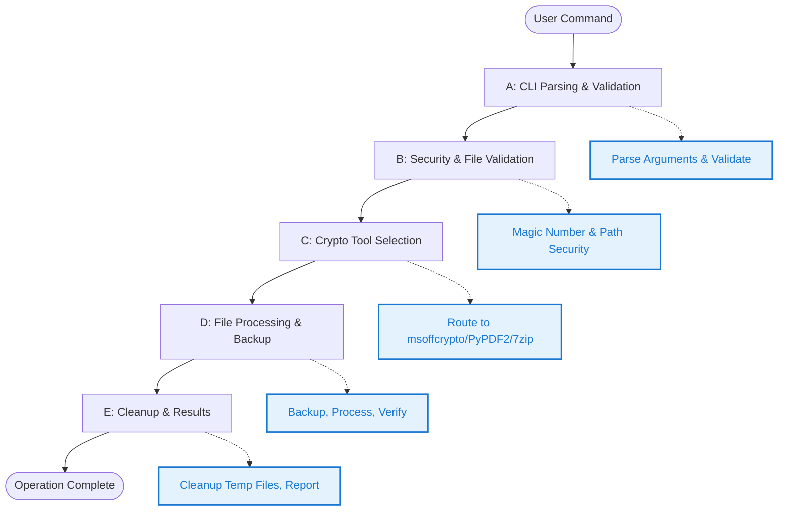
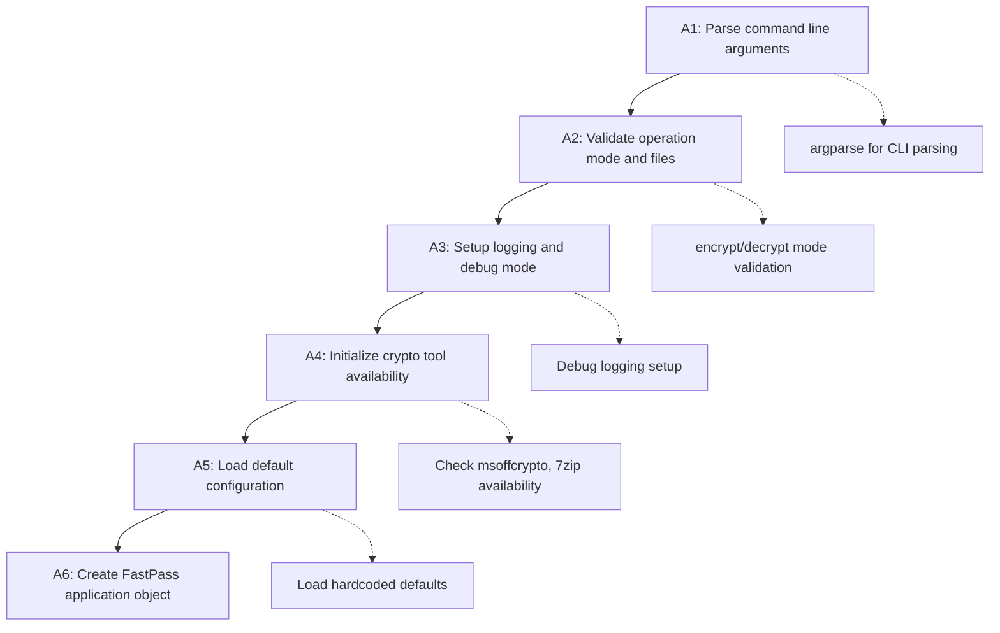
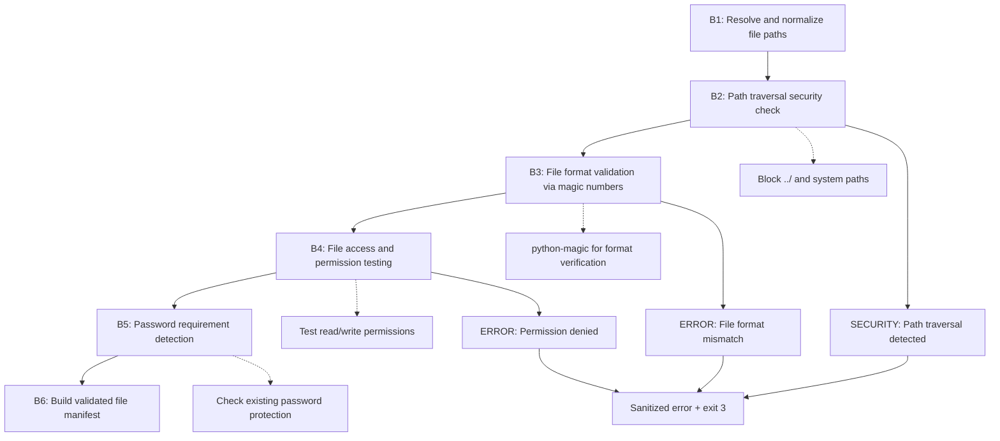
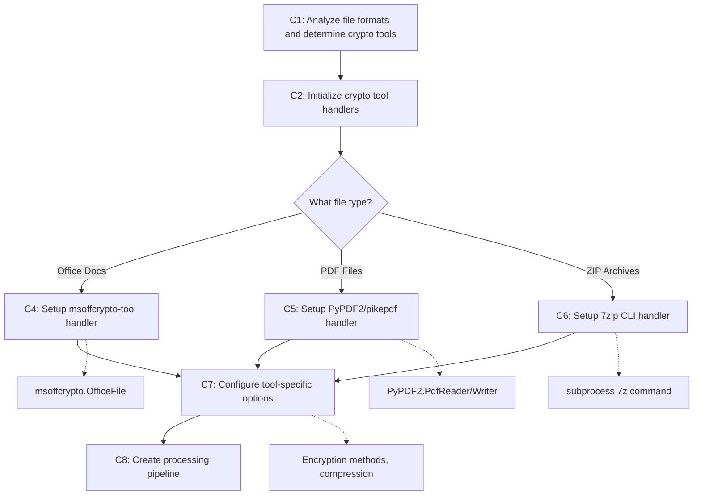
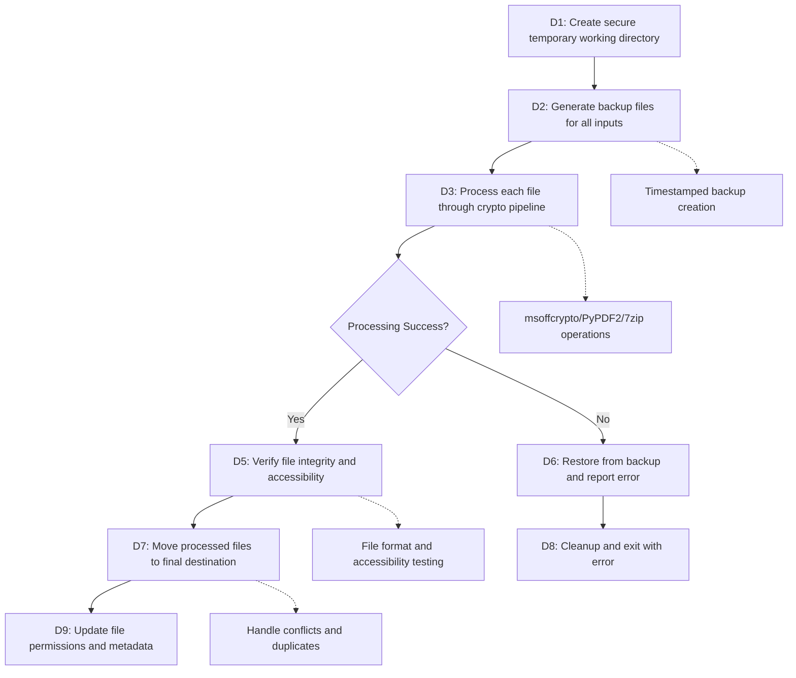
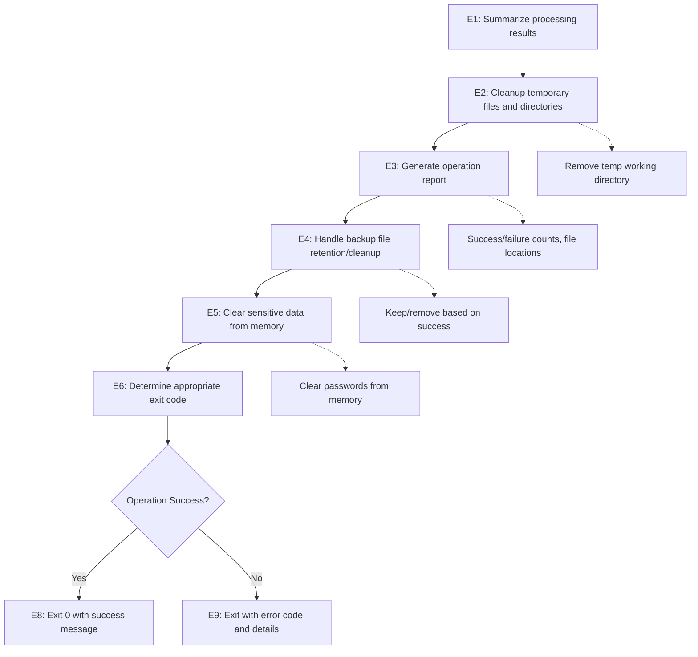

# FastPass - Complete Project Specification

## Project Mission & Purpose

**FastPass** is a command-line tool that provides universal file encryption and decryption capabilities across multiple file formats. It serves as a unified front-end wrapper for specialized crypto tools (msoffcrypto-tool, PyPDF2/pikepdf, 7zip CLI) to add or remove password protection from Microsoft Office documents, PDF files, and ZIP archives.

**Core Problem Solved:** Eliminates the need to learn and manage multiple separate tools for file encryption/decryption across different formats. Provides a consistent, secure interface for password protection operations while maintaining file integrity and implementing enterprise-grade security practices.

**Key Differentiator:** Unified CLI interface with enterprise security patterns including automatic backup creation, file isolation, magic number validation, and secure password handling. Follows proven architecture patterns from the FastRedline project for reliability and security.

---

## Product Requirements Document (PRD)

### Project Overview

- **Project Name:** FastPass
- **Version:** v1.0
- **Target Platform:** Windows Desktop (CLI) with cross-platform Python support
- **Technology Stack:** Python, msoffcrypto-tool, PyPDF2/pikepdf, 7zip CLI, python-magic, pathlib
- **Timeline:** 4-6 weeks development
- **Team Size:** Single developer maintained

### Target Users

- **Primary Users:** IT administrators, security professionals, business users
- **Secondary Users:** Developers, system integrators, automation script writers
- **User Experience Level:** Intermediate (comfortable with command-line tools)
- **Use Cases:** Batch file encryption, automated security workflows, document protection, archive security

### Feature Specifications

#### Core Functionality
- [x] Universal file encryption/decryption interface
- [x] Microsoft Office document password protection (.docx, .xlsx, .pptx, .doc, .xls, .ppt)
- [x] PDF password protection and removal
- [x] ZIP archive password protection using 7zip
- [x] Batch processing for multiple files
- [x] Automatic file format detection and routing to appropriate crypto tool

#### Security & File Safety
- [x] Automatic backup creation before any modification
- [x] File format validation using magic number checking
- [x] Path traversal attack prevention
- [x] Secure temporary file creation with proper permissions (0o600)
- [x] Password memory clearing and secure handling
- [x] Error message sanitization to prevent information disclosure

#### Password Management
- [x] Command-line password input with secure handling
- [x] JSON password input via stdin for GUI integration
- [x] Interactive password prompts with hidden input
- [x] Secure random password generation
- [x] Password verification and strength validation

#### File Operations
- [x] In-place modification with automatic backup
- [x] Output directory specification for batch operations
- [x] File integrity verification after operations
- [x] Duplicate filename handling and conflict resolution
- [x] Comprehensive cleanup of temporary files

#### Utility Features
- [x] Dry-run mode for testing operations
- [x] File format support detection
- [x] Password requirement checking
- [x] Batch operation progress reporting
- [x] Detailed logging with debug mode

### Success Metrics

- **Performance Targets:** File processing < 10 seconds for typical business documents
- **User Experience:** Zero data loss, automatic backup creation, clear error messages
- **Reliability:** 99.9% successful completion rate for valid inputs
- **Security:** No password exposure in logs, secure temporary file handling

### Constraints & Assumptions

- **Technical Constraints:** Requires underlying crypto tools (msoffcrypto-tool, 7zip) to be available
- **Platform Constraints:** Some features may be Windows-specific due to 7zip CLI integration
- **Security Constraints:** Must maintain file confidentiality and integrity throughout operations
- **User Constraints:** Must have appropriate file permissions for input and output directories
- **Assumptions:** Users understand file encryption concepts and password management practices

---

## Command Line Reference

```
Usage: fast_pass [encrypt|decrypt] -f FILE [options]

Required Arguments:
  encrypt|decrypt           Operation mode: add or remove password protection
  -f, --file               Path to file to encrypt/decrypt (can be repeated for batch)

Password Options:
  -p, --password PASSWORD   Password for encryption/decryption
  -p stdin                 Read password from JSON via stdin (secure GUI integration)
  --generate-password      Generate secure random password (encryption only)
  --check-password         Check if file requires password (utility mode)

Output Options:
  -o, --output-dir DIR     Output directory (default: same as input file)
  --in-place              Modify file in-place (creates backup first)
  --backup-suffix SUFFIX  Backup file suffix (default: _backup_YYYYMMDD_HHMMSS)

Utility Options:
  --dry-run               Show what would be done without making changes
  --verify                Verify file integrity after operation
  --list-supported        List supported file formats
  --debug                 Enable detailed logging and debug output
  --version               Show version information
  --help                  Show this help message

Supported File Formats:
  Office Documents:  .docx, .xlsx, .pptx, .doc, .xls, .ppt
  PDF Files:         .pdf
  Archives:          .zip, .7z

Examples:
  # Encrypt single file with password
  fast_pass encrypt -f contract.docx -p "mypassword"
  
  # Decrypt file with password from stdin (GUI integration)
  fast_pass decrypt -f protected.pdf -p stdin < passwords.json
  
  # Encrypt with auto-generated password
  fast_pass encrypt -f document.docx --generate-password
  
  # Batch encrypt multiple files
  fast_pass encrypt -f file1.xlsx -f file2.pptx -p "shared_pwd" -o ./encrypted/
  
  # Decrypt ZIP archive with verification
  fast_pass decrypt -f archive.zip -p "zippass" --verify
  
  # Check if file requires password
  fast_pass --check-password document.pdf
  
  # Dry run to test operation
  fast_pass encrypt -f document.docx -p "test123" --dry-run

Exit Codes:
  0  Success
  1  General error (file access, crypto tool failure)
  2  Invalid arguments or command syntax
  3  Security violation (path traversal, invalid format)
  4  Password error (wrong password, authentication failure)
```

---

## Comprehensive Test Specifications

**Testing Strategy:** Comprehensive test suite covering CLI functionality, security validation, file format support, crypto tool integration, and error handling. Tests organized by functionality area with specific input/output validation.

| Status | Test Case | Command | Description | Input/Setup | Expected Output/Outcome |
|--------|-----------|---------|-------------|-------------|-------------------------|
| [ ] | **test_001_version_command** | `python.exe -m fast_pass --version` | Validates basic CLI functionality and version display | Requires python.exe and fast_pass module accessible | Exit code 0, stdout contains "FastPass" and version number |
| [ ] | **test_002_help_command** | `python.exe -m fast_pass --help` | Verifies built-in help functionality and argument parser | No specific files required | Exit code 0, stdout contains usage information |
| [ ] | **test_003_list_supported_formats** | `python.exe -m fast_pass --list-supported` | Tests supported format enumeration | No files required | Exit code 0, lists .docx, .pdf, .zip formats |
| [ ] | **test_004_invalid_arguments** | `python.exe -m fast_pass --invalid-flag` | Validates argument parser rejection of unknown flags | Arbitrary non-existent flag | Exit code 2, stderr contains argument error |
| [ ] | **test_005_missing_required_args** | `python.exe -m fast_pass encrypt` | Ensures CLI requires file argument | No file specified | Exit code 2, stderr contains "required" |
| [ ] | **test_006_encrypt_docx_basic** | `python.exe -m fast_pass encrypt -f test.docx -p "password123"` | Tests basic Office document encryption | Unprotected test.docx file | Exit code 0, creates backup and encrypted file |
| [ ] | **test_007_decrypt_docx_basic** | `python.exe -m fast_pass decrypt -f protected.docx -p "password123"` | Tests basic Office document decryption | Password-protected .docx file | Exit code 0, creates backup and decrypted file |
| [ ] | **test_008_encrypt_pdf_basic** | `python.exe -m fast_pass encrypt -f test.pdf -p "pdfpass"` | Tests PDF encryption functionality | Unprotected PDF file | Exit code 0, creates password-protected PDF |
| [ ] | **test_009_decrypt_pdf_basic** | `python.exe -m fast_pass decrypt -f protected.pdf -p "pdfpass"` | Tests PDF decryption functionality | Password-protected PDF file | Exit code 0, removes password protection |
| [ ] | **test_010_encrypt_zip_basic** | `python.exe -m fast_pass encrypt -f test.zip -p "zippass"` | Tests ZIP archive encryption via 7zip | Unprotected ZIP file | Exit code 0, creates password-protected ZIP |
| [ ] | **test_011_magic_number_validation** | `python.exe -m fast_pass encrypt -f fake.docx -p "test"` | Tests file format validation using magic numbers | Binary file with .docx extension | Exit code 3, security error about format mismatch |
| [ ] | **test_012_path_traversal_security** | `python.exe -m fast_pass encrypt -f "../../../etc/passwd" -p "test"` | Security test to prevent path traversal attacks | Malicious path with ../ traversal | Exit code 3, security violation error |
| [ ] | **test_013_backup_creation** | `python.exe -m fast_pass encrypt -f document.docx -p "test" --debug` | Verifies automatic backup file creation | Valid .docx file | Exit code 0, backup file created with timestamp |
| [ ] | **test_014_stdin_password_input** | `echo '{"document.pdf": "secret"}' \| python.exe -m fast_pass decrypt -f document.pdf -p stdin` | Tests secure password input via JSON stdin | Protected PDF, JSON password data | Exit code 0, file decrypted successfully |
| [ ] | **test_015_generate_password** | `python.exe -m fast_pass encrypt -f document.docx --generate-password` | Tests automatic secure password generation | Unprotected .docx file | Exit code 0, displays generated password, encrypts file |
| [ ] | **test_016_batch_processing** | `python.exe -m fast_pass encrypt -f file1.docx -f file2.pdf -p "shared" -o ./output/` | Tests multiple file batch encryption | Multiple unprotected files | Exit code 0, all files encrypted in output directory |
| [ ] | **test_017_in_place_modification** | `python.exe -m fast_pass encrypt -f document.docx -p "test" --in-place` | Tests in-place file modification with backup | Unprotected .docx file | Exit code 0, original file encrypted, backup created |
| [ ] | **test_018_file_integrity_verification** | `python.exe -m fast_pass encrypt -f document.pdf -p "test" --verify` | Tests file integrity verification after operation | Valid PDF file | Exit code 0, verification success message |
| [ ] | **test_019_dry_run_mode** | `python.exe -m fast_pass encrypt -f document.docx -p "test" --dry-run` | Tests dry-run mode without actual changes | Valid .docx file | Exit code 0, shows planned operations, no file changes |
| [ ] | **test_020_check_password_utility** | `python.exe -m fast_pass --check-password protected.docx` | Tests password requirement detection | Password-protected .docx file | Exit code 0 (needs password) or 1 (no password needed) |
| [ ] | **test_021_wrong_password_handling** | `python.exe -m fast_pass decrypt -f protected.docx -p "wrongpass"` | Tests incorrect password error handling | Protected file with wrong password | Exit code 4, password authentication error |
| [ ] | **test_022_unsupported_format** | `python.exe -m fast_pass encrypt -f document.txt -p "test"` | Tests rejection of unsupported file formats | .txt file (unsupported format) | Exit code 3, unsupported format error |
| [ ] | **test_023_file_permissions_check** | `python.exe -m fast_pass encrypt -f readonly.docx -p "test"` | Tests handling of read-only files | Read-only .docx file | Exit code 1, permission error with helpful message |
| [ ] | **test_024_temporary_file_cleanup** | `python.exe -m fast_pass encrypt -f document.docx -p "test" --debug` | Tests proper cleanup of temporary files | Valid .docx file with debug logging | Exit code 0, debug log shows temp file cleanup |
| [ ] | **test_025_error_message_sanitization** | `python.exe -m fast_pass encrypt -f "/sensitive/path/file.docx" -p "test"` | Tests error message sanitization for security | File in sensitive system path | Error message doesn't expose full sensitive path |

---

## High-Level Architecture Overview

> 💡 This diagram shows the overall system architecture and main components of FastPass.



---

## Section A: CLI Parsing & Initialization

> This phase handles command-line argument parsing, configuration setup, and initial validation.



**What's Actually Happening:**
- **A1: Command Line Argument Processing**
  - `sys.argv` contains raw command like `['fast_pass', 'encrypt', '-f', 'document.docx', '-p', 'password123']`
  - `argparse.ArgumentParser()` creates parser with custom action classes for file tracking
  - `args.operation` becomes `'encrypt'` or `'decrypt'` (required positional argument)
  - `args.files` becomes list of file paths like `['document.docx', 'spreadsheet.xlsx']`
  - `args.password` contains password string or `'stdin'` for JSON input
  - `args.output_dir` defaults to `None` (same directory as input files)
  - `args.debug` boolean flag for verbose logging
  - Password handling: `args.generate_password` for auto-generation mode

- **A2: Operation Mode & File Path Validation**
  - Validate operation: `args.operation in ['encrypt', 'decrypt']`
  - File existence check: `os.path.exists(file_path)` for each input file
  - Path normalization: `os.path.abspath(os.path.expanduser(file_path))`
  - Conflict detection: if `--in-place` and `--output-dir` both specified, show error
  - Build file list: `self.input_files = [{'path': normalized_path, 'exists': bool}]`
  - Special modes: `--check-password`, `--list-supported` bypass normal file requirements

- **A3: Logging System Configuration**
  - `logging.basicConfig()` with `level=logging.DEBUG` if `args.debug` enabled
  - Log format: `'%(asctime)s - %(levelname)s - %(message)s'`
  - Handler: `sys.stderr` for console output, doesn't interfere with stdout
  - First log entry: `"FastPass v1.0 starting - operation: {args.operation}"`
  - Memory logger: `self.operation_log = []` for operation history
  - Debug flag: `self.debug_mode = args.debug`

- **A4: Crypto Tool Availability Detection**
  - Test msoffcrypto-tool: `subprocess.run(['python', '-m', 'msoffcrypto.cli', '--version'])`
  - Test 7zip availability: `subprocess.run(['7z'])` or check common install paths
  - Test PyPDF2/pikepdf: `import PyPDF2; import pikepdf` with fallback handling
  - Store availability: `self.crypto_tools = {'msoffcrypto': bool, '7zip': bool, 'pdf': str}`
  - If required tools missing: log warning, may exit with helpful error message

- **A5: Configuration & Default Setup**
  - `self.config = {'backup_suffix': '_backup_{timestamp}', 'temp_dir_prefix': 'FastPass_'}`
  - `self.config['secure_permissions'] = 0o600` (read/write owner only)
  - `self.config['max_file_size'] = 500 * 1024 * 1024` (500MB limit)
  - `self.config['supported_formats'] = {'.docx': 'msoffcrypto', '.pdf': 'pypdf2', '.zip': '7zip'}`
  - Password policy: `self.config['min_password_length'] = 1` (no minimum enforced)
  - Cleanup settings: `self.config['cleanup_on_error'] = True`

- **A6: FastPass Application Object Creation**
  - Main `FastPass(args)` object instantiated with parsed arguments
  - `self.operation_mode = args.operation` ('encrypt' or 'decrypt')
  - `self.file_processors = {}` (will map files to appropriate crypto handlers)
  - `self.temp_files_created = []` (tracking for cleanup)
  - `self.backup_files_created = []` (tracking backups for rollback)
  - `self.operation_start_time = datetime.now()` for timing
  - State flags: `self.ready_for_processing = True`, `self.cleanup_required = False`

---

## Section B: Security & File Validation

> This phase implements comprehensive security validation including path traversal prevention, file format validation, and input sanitization following FastRedline patterns.



**What's Actually Happening:**
- **B1: File Path Resolution & Normalization**
  - For each file in `args.files`:
  - `os.path.expanduser()` converts `~` to actual user home directory
  - `os.path.abspath()` converts relative paths to full absolute paths
  - `os.path.normpath()` resolves `../` patterns and normalizes separators
  - `pathlib.Path(file_path).resolve()` gets canonical path resolving symlinks
  - Store in `self.validated_files = [{'original_path': str, 'resolved_path': Path, 'exists': bool}]`
  - Missing file handling: if `not path.exists()`, add to `missing_files[]` list

- **B2: Security Analysis & Path Traversal Prevention**
  - For each resolved path, extract path components: `path.parts`
  - Check for dangerous patterns: `['..', '/', '\\', 'C:\\Windows\\', 'C:\\System32\\']`
  - Validate against allowed directories: user home, current working directory, specified output dirs
  - Use `os.path.commonpath()` to ensure files within allowed boundaries
  - Path escape detection: `if not str(resolved_path).startswith(allowed_base_path):`
  - Security violation: `self.security_violations.append({'file': filename, 'violation': 'path_traversal'})`
  - If violations found: sanitize error message, `sys.exit(3)` with security error

- **B3: File Format Validation Using Magic Numbers**
  - Import `magic` library: `import magic`
  - For each file: `detected_mime = magic.from_file(str(file_path), mime=True)`
  - Expected MIME mappings:
    ```python
    expected_mimes = {
        '.docx': 'application/vnd.openxmlformats-officedocument.wordprocessingml.document',
        '.xlsx': 'application/vnd.openxmlformats-officedocument.spreadsheetml.sheet',
        '.pdf': 'application/pdf',
        '.zip': 'application/zip'
    }
    ```
  - Compare: `actual_extension = file_path.suffix.lower()`
  - Validation: `if detected_mime != expected_mimes.get(actual_extension):`
  - Read file signature: `with open(file_path, 'rb') as f: signature = f.read(8)`
  - DOCX/Office: should start with `PK` (ZIP signature: `50 4B 03 04`)
  - PDF: should start with `%PDF` (25 50 44 46)
  - Format mismatch: `self.format_violations.append({'file': filename, 'expected': expected, 'detected': detected})`

- **B4: File Access & Permission Verification**
  - Test read access: `with open(file_path, 'rb') as test: sample = test.read(1024)`
  - File size check: `file_size = os.path.getsize(file_path)`
  - Size limits: `if file_size > self.config['max_file_size']: flag as oversized`
  - Empty file check: `if file_size == 0: flag as empty`
  - Output directory write test: `os.access(output_dir, os.W_OK)` if specified
  - Permission storage: `self.file_metadata[file_path] = {'size': int, 'readable': bool, 'writable_destination': bool}`
  - Permission failures: add to `self.access_violations[]` for reporting

- **B5: Password Protection Status Detection**
  - **Office Documents**: Use msoffcrypto to check encryption
    ```python
    with open(file_path, 'rb') as f:
        office_file = msoffcrypto.OfficeFile(f)
        is_encrypted = office_file.is_encrypted()
    ```
  - **PDF Files**: Use PyPDF2 to check for password protection
    ```python
    with open(file_path, 'rb') as f:
        pdf_reader = PyPDF2.PdfReader(f)
        is_encrypted = pdf_reader.is_encrypted
    ```
  - **ZIP Archives**: Test with 7zip list command to detect password protection
  - Store status: `self.password_status[file_path] = {'currently_protected': bool, 'protection_type': str}`
  - Operation validation: if decrypt mode and not protected, log warning
  - If encrypt mode and already protected, ask for confirmation or fail

- **B6: Validated File Manifest Creation**
  - Compile validation results: `self.file_manifest = []`
  - For each file that passed all validations:
    ```python
    manifest_entry = {
        'path': Path,
        'format': str,
        'size': int,
        'currently_protected': bool,
        'crypto_tool': str,
        'backup_required': bool
    }
    ```
  - Route to crypto tools: map file extensions to handlers
  - Validation summary: `total_files = len(self.file_manifest)`
  - Error summary: `security_errors = len(self.security_violations)`
  - If any critical errors: `sys.exit(3)` with detailed error report
  - Success state: `self.validation_complete = True`

---

## Section C: Crypto Tool Selection & Routing

> This phase determines the appropriate crypto tool for each file format and initializes the processing pipeline.



**What's Actually Happening:**
- **C1: File Format Analysis & Tool Mapping**
  - Process validated file manifest: `for file_entry in self.file_manifest:`
  - Extension-to-tool mapping:
    ```python
    tool_mapping = {
        '.docx': 'msoffcrypto', '.xlsx': 'msoffcrypto', '.pptx': 'msoffcrypto',
        '.doc': 'msoffcrypto', '.xls': 'msoffcrypto', '.ppt': 'msoffcrypto',
        '.pdf': 'pypdf2',
        '.zip': '7zip', '.7z': '7zip'
    }
    ```
  - Assign crypto tool: `file_entry['crypto_tool'] = tool_mapping[file_entry['extension']]`
  - Group by tool: `self.tool_groups = {'msoffcrypto': [], 'pypdf2': [], '7zip': []}`
  - Availability check: ensure required tools are available for file types present
  - If tool missing: `sys.exit(1)` with "Required crypto tool not available: {tool_name}"

- **C2: Crypto Tool Handler Initialization**
  - **msoffcrypto Handler**:
    ```python
    class OfficeHandler:
        def __init__(self):
            self.tool_path = 'python -m msoffcrypto.cli'
            self.temp_files = []
        
        def encrypt(self, input_path, output_path, password):
            # Implementation using msoffcrypto
        
        def decrypt(self, input_path, output_path, password):
            # Implementation using msoffcrypto
    ```
  - **PyPDF2 Handler**:
    ```python
    class PDFHandler:
        def __init__(self):
            self.use_pikepdf = self._check_pikepdf_availability()
        
        def encrypt(self, input_path, output_path, password):
            # Implementation using PyPDF2 or pikepdf
    ```
  - **7zip Handler**:
    ```python
    class ZipHandler:
        def __init__(self):
            self.zip_path = self._find_7zip_executable()
            self.compression_level = 5
    ```

- **C4: msoffcrypto-tool Configuration**
  - Test tool availability: `subprocess.run(['python', '-m', 'msoffcrypto.cli', '--version'])`
  - Configure encryption options:
    ```python
    office_config = {
        'password_method': 'standard',  # Use standard Office encryption
        'temp_dir': self.temp_working_dir,
        'preserve_metadata': True
    }
    ```
  - Set handler methods: `self.office_handler.set_config(office_config)`
  - Store in pipeline: `self.crypto_handlers['msoffcrypto'] = office_handler`

- **C5: PyPDF2/pikepdf Configuration** 
  - Detect available PDF library:
    ```python
    try:
        import pikepdf
        self.pdf_library = 'pikepdf'  # Preferred for better encryption
    except ImportError:
        import PyPDF2
        self.pdf_library = 'pypdf2'
    ```
  - Configure PDF encryption settings:
    ```python
    pdf_config = {
        'encryption_algorithm': 'AES-256',
        'permissions': {'print': True, 'modify': False, 'copy': True},
        'user_password': None,  # Will be set per operation
        'owner_password': None  # Same as user password by default
    }
    ```

- **C6: 7zip CLI Configuration**
  - Locate 7zip executable:
    ```python
    zip_paths = ['7z', 'C:\\Program Files\\7-Zip\\7z.exe', 'C:\\Program Files (x86)\\7-Zip\\7z.exe']
    for path in zip_paths:
        if subprocess.run([path], capture_output=True).returncode != 1:  # 1 = no args, but tool works
            self.zip_executable = path
            break
    ```
  - Configure 7zip options:
    ```python
    zip_config = {
        'compression_method': 'AES256',  # Strong encryption
        'compression_level': 5,         # Balanced speed/size
        'solid_archive': False,         # Better for individual file access
        'exclude_patterns': []          # No exclusions by default
    }
    ```

- **C7: Tool-Specific Option Configuration**
  - **Office Documents**: Set metadata preservation, compatible encryption methods
  - **PDF Files**: Configure user/owner passwords, permission settings
  - **ZIP Archives**: Set compression level, encryption method, file patterns
  - Password validation: ensure passwords meet tool-specific requirements
  - Error handling: configure timeout values, retry attempts for each tool
  - Logging: set up per-tool debug logging if enabled

- **C8: Processing Pipeline Creation**
  - Build processing queue: `self.processing_queue = []`
  - For each file, create processing task:
    ```python
    task = {
        'file_path': Path,
        'operation': 'encrypt' | 'decrypt',
        'crypto_handler': handler_object,
        'password': str,
        'output_path': Path,
        'backup_path': Path,
        'temp_files': []
    }
    ```
  - Sort by file size: process smaller files first for faster feedback
  - Dependency resolution: if files depend on each other, order appropriately
  - Pipeline validation: ensure all tasks have required inputs and handlers
  - Ready state: `self.pipeline_ready = True`, `self.total_tasks = len(processing_queue)`

---

## Section D: File Processing & Backup Operations

> This phase handles the core file processing operations including backup creation, crypto operations, and file integrity verification.



**What's Actually Happening:**
- **D1: Secure Temporary Directory Setup**
  - Create session temp directory: 
    ```python
    import tempfile
    self.temp_working_dir = Path(tempfile.mkdtemp(
        prefix='FastPass_', 
        suffix=f'_{datetime.now().strftime("%Y%m%d_%H%M%S")}_{os.getpid()}'
    ))
    ```
  - Set secure permissions: `os.chmod(self.temp_working_dir, 0o700)` (owner access only)
  - Register for cleanup: `self.cleanup_registry.append(self.temp_working_dir)`
  - Create subdirectories: `backups/`, `processing/`, `output/` within temp directory
  - Log creation: `"Created secure temp directory: {self.temp_working_dir}"`

- **D2: Backup File Creation**
  - For each file in processing queue:
  - Generate backup filename: 
    ```python
    timestamp = datetime.now().strftime('%Y%m%d_%H%M%S')
    backup_name = f"{file_path.stem}_backup_{timestamp}{file_path.suffix}"
    backup_path = self.temp_working_dir / 'backups' / backup_name
    ```
  - Create backup: `shutil.copy2(file_path, backup_path)` (preserves metadata)
  - Verify backup: check file size matches, basic accessibility test
  - Set backup permissions: `os.chmod(backup_path, 0o600)` (read/write owner only)
  - Store backup info: `self.backup_files[file_path] = {'backup_path': backup_path, 'created': datetime.now()}`
  - If backup fails: `sys.exit(1)` with "Failed to create backup for: {filename}"

- **D3: Crypto Processing Pipeline Execution**
  - **Office Document Processing (msoffcrypto)**:
    ```python
    def process_office_file(self, file_path, operation, password):
        with open(file_path, 'rb') as input_file:
            office_file = msoffcrypto.OfficeFile(input_file)
            if operation == 'decrypt':
                office_file.load_key(password=password)
                with open(temp_output, 'wb') as output_file:
                    office_file.decrypt(output_file)
            elif operation == 'encrypt':
                # Use msoffcrypto encrypt functionality
                office_file.encrypt(password=password, output_file=temp_output)
    ```
  
  - **PDF Processing (PyPDF2/pikepdf)**:
    ```python
    def process_pdf_file(self, file_path, operation, password):
        if self.pdf_library == 'pikepdf':
            import pikepdf
            if operation == 'decrypt':
                with pikepdf.open(file_path, password=password) as pdf:
                    pdf.save(temp_output)
            elif operation == 'encrypt':
                with pikepdf.open(file_path) as pdf:
                    pdf.save(temp_output, encryption=pikepdf.Encryption(
                        user=password, owner=password))
    ```
  
  - **ZIP Processing (7zip CLI)**:
    ```python
    def process_zip_file(self, file_path, operation, password):
        if operation == 'decrypt':
            cmd = [self.zip_executable, 'x', str(file_path), f'-p{password}', f'-o{temp_output_dir}']
        elif operation == 'encrypt':
            cmd = [self.zip_executable, 'a', f'-p{password}', str(temp_output), str(file_path)]
        result = subprocess.run(cmd, capture_output=True, text=True)
        if result.returncode != 0:
            raise CryptoProcessingError(f"7zip error: {result.stderr}")
    ```

- **D4: Processing Success Validation**
  - Check subprocess return codes: `if result.returncode != 0:`
  - Verify output file creation: `if not temp_output_path.exists():`
  - Basic file size validation: ensure output file has reasonable size (> 0, not suspiciously different)
  - Format validation: run magic number check on output to ensure proper format
  - If any validation fails: log error details, increment `self.processing_errors`
  - Success tracking: `self.successful_operations.append(file_path)`

- **D5: File Integrity & Accessibility Verification**  
  - **Format verification**: Run magic number check on processed file
  - **Accessibility test**: Try to open file with appropriate tool/library
  - **Office documents**: Test with `python-docx` or `openpyxl` for basic structure
  - **PDF files**: Test with PyPDF2 to ensure readable PDF structure
  - **ZIP archives**: Test with 7zip list command to verify archive integrity
  - **Password verification**: For encrypt operations, test that password is required
  - **For decrypt operations**: Test that file opens without password
  - Store verification results: `self.verification_results[file_path] = {'format_ok': bool, 'accessible': bool, 'password_status_correct': bool}`

- **D6: Error Handling & Backup Restoration**
  - If processing fails: restore original from backup
  - Restoration process: `shutil.copy2(backup_path, original_path)`
  - Preserve original timestamps: use `shutil.copy2` to maintain metadata
  - Clean up partial outputs: remove any temporary files created during failed processing
  - Error reporting: collect detailed error information for user
  - Log restoration: `"Restored {filename} from backup due to processing failure"`
  - Continue with next file or exit based on error severity

- **D7: Final File Placement & Conflict Resolution**
  - Determine final output location:
    ```python
    if args.in_place:
        final_path = original_file_path
    elif args.output_dir:
        final_path = Path(args.output_dir) / processed_file_name
    else:
        final_path = original_file_path.parent / processed_file_name
    ```
  - Handle filename conflicts: if file exists, append counter `_001`, `_002`, etc.
  - Move from temp to final: `shutil.move(temp_processed_file, final_path)`
  - Update file tracking: `self.output_files.append({'original': original_path, 'final': final_path})`

- **D8: Error Exit & Cleanup**
  - If critical errors occurred: prepare for early exit
  - Cleanup temp files: `shutil.rmtree(self.temp_working_dir, ignore_errors=True)`
  - Restore all files from backups if requested
  - Generate error report: summarize what failed and why
  - Set exit code: `sys.exit(1)` for processing errors

- **D9: File Permissions & Metadata Finalization**
  - Set appropriate permissions on output files: `os.chmod(output_file, 0o644)` (readable by all, writable by owner)
  - Preserve original timestamps where appropriate
  - Update file metadata: creation time, modification time based on operation type
  - For encrypted files: may want to set more restrictive permissions `0o600`
  - Generate file checksums: `hashlib.sha256()` for integrity verification
  - Store final metadata: `self.final_file_metadata[output_path] = {'size': int, 'checksum': str, 'permissions': oct}`

---

## Section E: Cleanup & Results Reporting

> This phase handles resource cleanup, result summarization, and proper exit code management.



**What's Actually Happening:**
- **E1: Operation Results Summarization**
  - Calculate success metrics:
    ```python
    summary = {
        'total_files': len(self.file_manifest),
        'successful': len(self.successful_operations),
        'failed': len(self.processing_errors),
        'skipped': len(self.skipped_files),
        'operation_duration': (datetime.now() - self.operation_start_time).total_seconds()
    }
    ```
  - Categorize results by operation type and file format
  - Track file size changes: compare original vs processed file sizes
  - Generate performance metrics: files per second, average processing time
  - Error categorization: group errors by type (password, format, permission, etc.)

- **E2: Temporary File & Directory Cleanup**
  - Clean up temp working directory:
    ```python
    try:
        shutil.rmtree(self.temp_working_dir)
        self.log_debug(f"Cleaned up temp directory: {self.temp_working_dir}")
    except Exception as e:
        self.log_warning(f"Failed to cleanup temp directory: {e}")
    ```
  - Remove individual temp files tracked: `for temp_file in self.temp_files_created:`
  - Clear crypto tool temporary files: call cleanup methods on handlers
  - Verify cleanup completion: check that temp directories no longer exist
  - Free disk space calculation: measure space freed by cleanup
  - Log cleanup results: "Cleanup completed: {count} files removed, {size}MB freed"

- **E3: Operation Report Generation**
  - **Success Report**:
    ```
    FastPass Operation Complete
    ===========================
    Operation: encrypt
    Files processed: 5/5 successful
    Output location: ./encrypted/
    Total time: 23.4 seconds
    
    Files:
      ✓ document.docx → document_encrypted.docx
      ✓ spreadsheet.xlsx → spreadsheet_encrypted.xlsx
      ✓ presentation.pptx → presentation_encrypted.pptx
    ```
  - **Error Report**:
    ```
    FastPass Operation Completed with Errors
    ========================================
    Files processed: 2/5 successful, 3 failed
    
    Successful:
      ✓ document.docx
      ✓ spreadsheet.xlsx
    
    Failed:
      ✗ protected.pdf - Wrong password
      ✗ corrupt.docx - File format error
      ✗ readonly.xlsx - Permission denied
    ```
  - Include file locations, sizes, processing times
  - Show backup locations if failures occurred
  - Provide next steps or troubleshooting guidance

- **E4: Backup File Management**
  - **Success case**: Remove backups if processing successful and not requested to keep
    ```python
    if not args.keep_backups and all_operations_successful:
        for backup_path in self.backup_files.values():
            backup_path['backup_path'].unlink()
    ```
  - **Failure case**: Keep backups and inform user of location
  - **Partial success**: Keep backups only for failed operations
  - Backup retention policy: auto-cleanup after 7 days unless `--keep-backups` specified
  - Generate backup manifest: list of all backups created with timestamps
  - Log backup status: "Backups retained: {count} files in {location}"

- **E5: Sensitive Data Memory Cleanup**
  - Clear password variables:
    ```python
    if hasattr(self, 'passwords'):
        for pwd in self.passwords:
            # Overwrite memory (Python limitation, best effort)
            pwd = 'X' * len(pwd)
        del self.passwords
    ```
  - Clear password-related data structures
  - Force garbage collection: `import gc; gc.collect()`
  - Clear command-line argument references that might contain passwords
  - Log security cleanup: "Sensitive data cleared from memory"

- **E6: Exit Code Determination**
  - **Exit Code 0**: All operations successful, no errors
    ```python
    if len(self.processing_errors) == 0 and len(self.successful_operations) > 0:
        return 0
    ```
  - **Exit Code 1**: Processing errors (file access, crypto tool failures, wrong passwords)
  - **Exit Code 2**: Invalid command-line arguments or usage errors  
  - **Exit Code 3**: Security violations (path traversal, format validation failures)
  - **Exit Code 4**: Authentication errors (wrong passwords, access denied)
  - Mixed results: return non-zero if any failures occurred
  - Store exit reason: `self.exit_reason = "3 files failed processing"`

- **E7: Success/Failure Branch Logic**
  - Evaluate overall operation success:
    ```python
    if self.exit_code == 0:
        self.log_info("Operation completed successfully")
        self.console_output("✓ All files processed successfully")
    else:
        self.log_error(f"Operation completed with errors: {self.exit_reason}")
        self.console_output(f"⚠ Operation completed with {len(self.processing_errors)} errors")
    ```

- **E8: Successful Exit Handling**
  - Display success message with summary
  - Show output file locations
  - Display any generated passwords (if --generate-password used)
  - Provide usage tips or next steps
  - Final log entry: "FastPass completed successfully - exiting with code 0"
  - Clean exit: `sys.exit(0)`

- **E9: Error Exit Handling**
  - Display error summary with specific failure details
  - Show troubleshooting guidance based on error types
  - Indicate backup file locations for recovery
  - Suggest command corrections if applicable
  - Final log entry: "FastPass completed with errors - exiting with code {self.exit_code}"
  - Error exit: `sys.exit(self.exit_code)`

---

## Technical Implementation Summary

This specification provides a comprehensive blueprint for FastPass development following proven security patterns from the FastRedline project. The document includes:

✓ **Complete PRD** with feature checklists targeting universal file encryption  
✓ **Detailed security patterns** including file isolation and backup creation  
✓ **Comprehensive test specifications** covering all crypto tools and security scenarios  
✓ **Technical architecture diagrams** with specific implementation details for each crypto tool  
✓ **Command-line interface** designed for both interactive and automated use  
✓ **Component-level processing flows** showing exact data structures and method calls  

Key implementation notes:
- **Security-first design** following FastRedline patterns for file safety
- **Multi-tool integration** with proper error handling and fallback mechanisms
- **Enterprise-grade backup** and recovery procedures
- **Comprehensive validation** at every stage of processing
- **Clean separation** between crypto tools while maintaining unified interface

This document contains sufficient detail for implementation while maintaining consistency with proven security patterns and architectural practices.