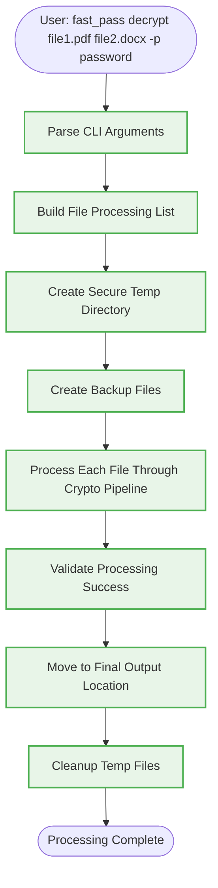
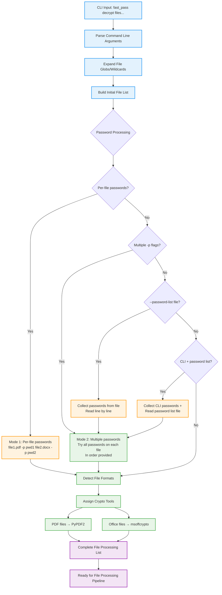
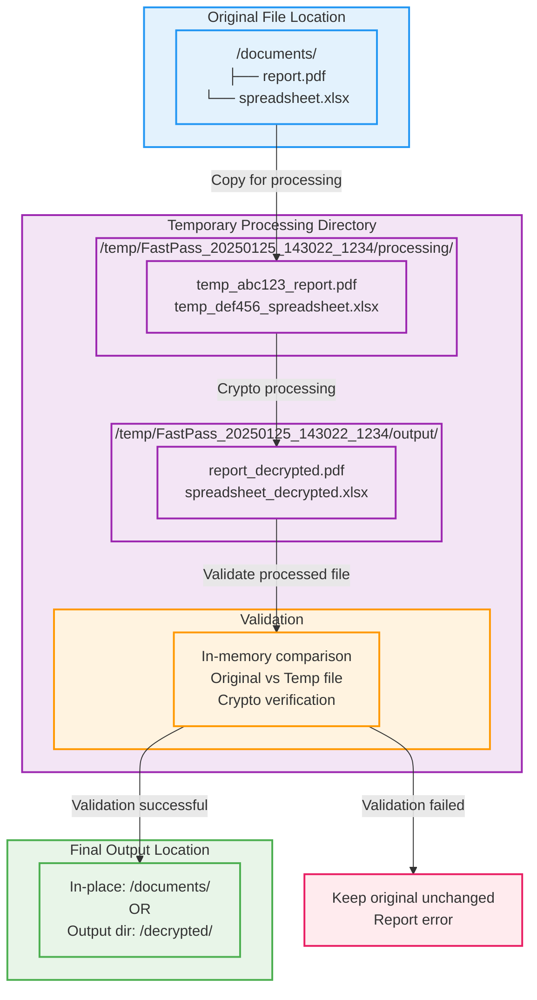
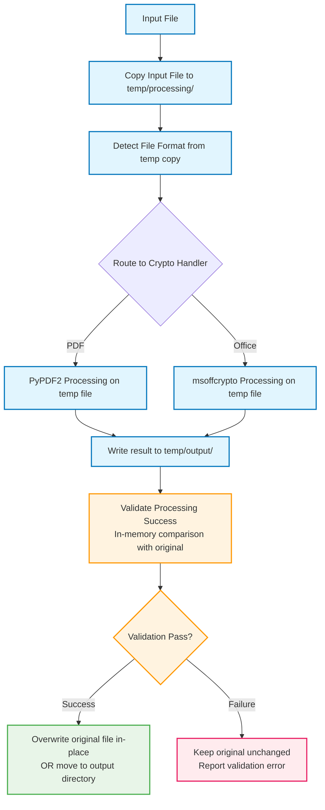
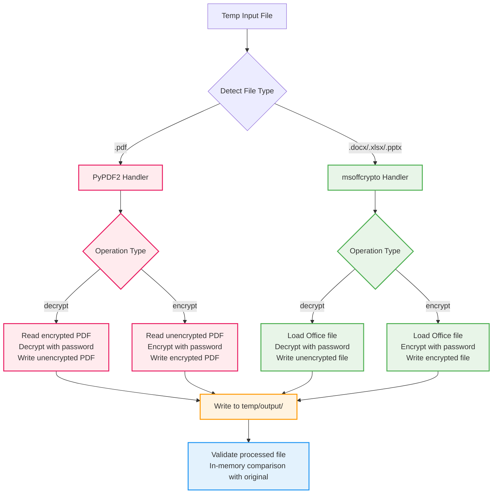
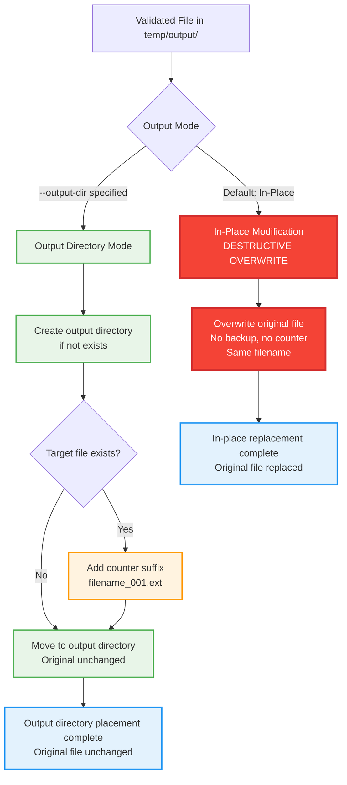
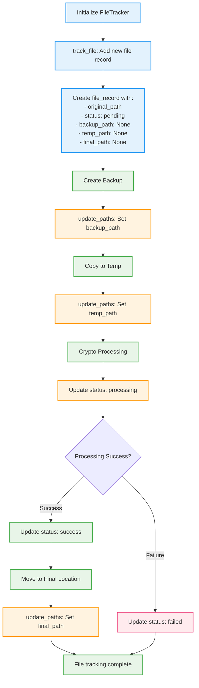
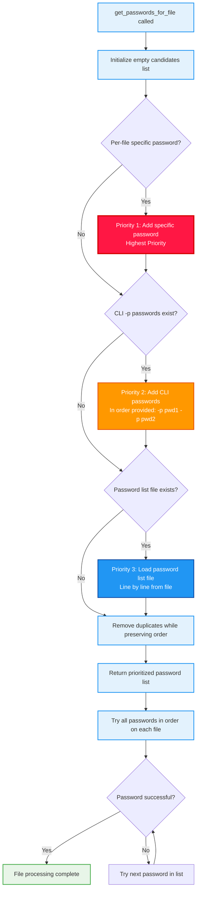
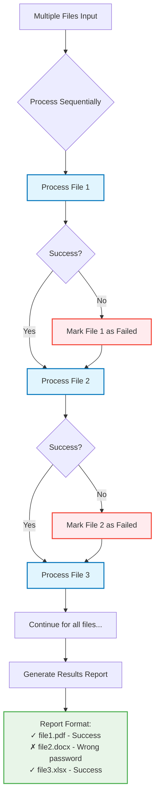

# FastPass - Core Business Logic Flow

This document focuses on the essential file processing workflow - how files are handled, where they're copied, and how final output is created.

## High-Level Processing Flow



## File Processing Pipeline

### 1. File List Preparation



**Input Processing:**
```python
# Multiple password approaches supported:

# 1. Per-file passwords: fast_pass decrypt file1.pdf -p "pwd1" file2.docx -p "pwd2"
file_processing_list = [
    {'path': Path('file1.pdf'), 'specific_password': 'pwd1', 'format': 'pdf'},
    {'path': Path('file2.docx'), 'specific_password': 'pwd2', 'format': 'office'}
]

# 2. Multiple passwords: fast_pass decrypt files*.pdf -p "pwd1" -p "pwd2" -p "pwd3"
password_candidates = ['pwd1', 'pwd2', 'pwd3']  # Try all on each file in order

# 3. Password list file: fast_pass decrypt files*.pdf --password-list passwords.txt
# passwords.txt contains:
# password123
# secret456
# admin789
# Collected as: password_candidates = ['password123', 'secret456', 'admin789']

# 4. Combined: fast_pass decrypt files*.pdf -p "urgent" --password-list common.txt
# Collected as: password_candidates = ['urgent', 'password123', 'secret456', 'admin789']
```

**Tool Assignment:**
```python
tool_mapping = {
    '.pdf': 'PyPDF2',
    '.docx': 'msoffcrypto', '.xlsx': 'msoffcrypto', '.pptx': 'msoffcrypto'
}
```

### 2. File Layout Structure



**Original File Location:**
```
/documents/                    # Original file location  
├── report.pdf                 # Original file (will be overwritten in-place)
└── spreadsheet.xlsx           # Original file (will be overwritten in-place)
```

**Temporary Directory Structure:**
```
/temp/FastPass_20250125_143022_1234/
├── processing/        # Input files copied here FIRST before any crypto operations
│   ├── temp_abc123_report.pdf
│   └── temp_def456_spreadsheet.xlsx
└── output/           # Final processed files after crypto operations
    ├── report_decrypted.pdf      # Validated before replacing original
    └── spreadsheet_decrypted.xlsx # Validated before replacing original
```

### 3. File Processing Workflow



### 4. Crypto Processing Details



#### PDF Processing (PyPDF2)

```mermaid
flowchart TD
    PDFInput[PDF Input File] --> OpenPDF[Open PDF with PyPDF2.PdfReader]
    OpenPDF --> CheckEncrypted{Is PDF encrypted?}
    
    CheckEncrypted -->|Yes - Decrypt Mode| DecryptPDF[reader.decrypt(password)]
    CheckEncrypted -->|No - Encrypt Mode| ReadPages[Read all pages]
    CheckEncrypted -->|No - Decrypt Mode| ReadPages
    
    DecryptPDF --> ReadPages
    ReadPages --> CreateWriter[Create PyPDF2.PdfWriter]
    CreateWriter --> AddPages[Add all pages to writer]
    
    AddPages --> CheckOperation{Operation Type}
    CheckOperation -->|encrypt| EncryptWriter[writer.encrypt(password)]
    CheckOperation -->|decrypt| WriteOutput[Write to temp output file]
    
    EncryptWriter --> WriteOutput
    WriteOutput --> PDFComplete[PDF Processing Complete]
    
    classDef pdfStep fill:#ffebee,stroke:#e91e63,stroke-width:2px
    classDef operationStep fill:#e3f2fd,stroke:#2196f3,stroke-width:2px
    classDef successStep fill:#e8f5e8,stroke:#4caf50,stroke-width:2px
    
    class PDFInput,OpenPDF,ReadPages,CreateWriter,AddPages pdfStep
    class CheckEncrypted,DecryptPDF,CheckOperation,EncryptWriter operationStep
    class WriteOutput,PDFComplete successStep
```

```python
def process_pdf_file(input_path, temp_output, password, operation):
    import PyPDF2
    
    if operation == 'decrypt':
        with open(input_path, 'rb') as input_file:
            reader = PyPDF2.PdfReader(input_file)
            if reader.is_encrypted:
                reader.decrypt(password)
            writer = PyPDF2.PdfWriter()
            for page in reader.pages:
                writer.add_page(page)
            with open(temp_output, 'wb') as output_file:
                writer.write(output_file)
    
    elif operation == 'encrypt':
        with open(input_path, 'rb') as input_file:
            reader = PyPDF2.PdfReader(input_file)
            writer = PyPDF2.PdfWriter()
            for page in reader.pages:
                writer.add_page(page)
            writer.encrypt(password)
            with open(temp_output, 'wb') as output_file:
                writer.write(output_file)
```

#### Office Document Processing (msoffcrypto)

```mermaid
flowchart TD
    OfficeInput[Office Input File<br/>.docx/.xlsx/.pptx] --> OpenOffice[Open with msoffcrypto.OfficeFile]
    OpenOffice --> CheckOperation{Operation Type}
    
    CheckOperation -->|decrypt| LoadKey[office_file.load_key(password)]
    CheckOperation -->|encrypt| EncryptFile[office_file.encrypt(password)]
    
    LoadKey --> OpenOutput[Open temp output file for writing]
    OpenOutput --> DecryptFile[office_file.decrypt(output_file)]
    DecryptFile --> OfficeDecryptComplete[Office Decrypt Complete]
    
    EncryptFile --> OfficeEncryptComplete[Office Encrypt Complete]
    
    classDef officeStep fill:#e8f5e8,stroke:#4caf50,stroke-width:2px
    classDef operationStep fill:#e3f2fd,stroke:#2196f3,stroke-width:2px
    classDef successStep fill:#fff3e0,stroke:#ff9800,stroke-width:2px
    
    class OfficeInput,OpenOffice officeStep
    class CheckOperation,LoadKey,OpenOutput,DecryptFile,EncryptFile operationStep
    class OfficeDecryptComplete,OfficeEncryptComplete successStep
```

```python
def process_office_file(input_path, temp_output, password, operation):
    import msoffcrypto
    
    with open(input_path, 'rb') as input_file:
        office_file = msoffcrypto.OfficeFile(input_file)
        
        if operation == 'decrypt':
            office_file.load_key(password=password)
            with open(temp_output, 'wb') as output_file:
                office_file.decrypt(output_file)
        
        elif operation == 'encrypt':
            office_file.encrypt(password=password, output_file=temp_output)
```


### 5. Output File Placement



#### In-Place Modification (Default)
```python
# Original: /documents/report.pdf
# Temp:     /temp/processing/temp_abc123_report.pdf (input copy)
# Process:  /temp/output/report_decrypted.pdf (validated processed result)
# Final:    /documents/report.pdf (DESTRUCTIVELY overwrites original)

# DESTRUCTIVE in-place replacement - no backup, no counter
final_path = original_file_path  # Same path as original
shutil.move(temp_processed_file, final_path)  # Overwrites original file
```

#### Output Directory Mode
```python
# Original: /documents/report.pdf
# Output:   /decrypted/report.pdf (original unchanged)

if args.output_dir:
    final_path = Path(args.output_dir) / processed_file_name
    final_path.parent.mkdir(parents=True, exist_ok=True)
    shutil.move(temp_processed_file, final_path)
```

#### Conflict Resolution
```python
# If target exists, append counter
if final_path.exists():
    stem = final_path.stem
    suffix = final_path.suffix
    counter = 1
    while final_path.exists():
        final_path = final_path.parent / f"{stem}_{counter:03d}{suffix}"
        counter += 1
```

### 6. File Tracking Throughout Process



```python
class FileTracker:
    def __init__(self):
        self.file_operations = []
    
    def track_file(self, original_path, operation):
        file_record = {
            'original_path': Path(original_path),
            'backup_path': None,
            'temp_path': None, 
            'final_path': None,
            'operation': operation,
            'status': 'pending',
            'crypto_tool': None
        }
        self.file_operations.append(file_record)
        return file_record
    
    def update_paths(self, record, backup_path=None, temp_path=None, final_path=None):
        if backup_path:
            record['backup_path'] = Path(backup_path)
        if temp_path:
            record['temp_path'] = Path(temp_path)
        if final_path:
            record['final_path'] = Path(final_path)
```

### 7. Password Selection Algorithm



```python
def get_passwords_for_file(file_path, specific_password=None):
    """Get prioritized list of passwords to try for a file"""
    candidates = []
    
    # Priority 1: Per-file specific password (highest priority)
    if specific_password and specific_password != 'stdin':
        candidates.append(specific_password)
        
    # Priority 2: CLI -p passwords (in order provided)  
    candidates.extend(cli_passwords)  # From multiple -p flags
    
    # Priority 3: Password list file (line by line)
    if password_list_file:
        candidates.extend(load_password_list())
        
    # Remove duplicates while preserving order
    return list(dict.fromkeys(candidates))

# Example usage:
# fast_pass decrypt file1.pdf -p "specific" -p "common1" -p "common2" --password-list list.txt
#
# For file1.pdf, password order will be:
# 1. "specific" (per-file specific password)
# 2. "common1" (CLI password) 
# 3. "common2" (CLI password)
# 4. "password123" (from list.txt)
# 5. "secret456" (from list.txt)
# 6. "admin789" (from list.txt)
#
# SAME password order used for ALL files (no reuse pool)
```

### 8. Batch Processing Flow



### 9. Results and Cleanup

```mermaid
flowchart TD
    ProcessingComplete[All Files Processed] --> EvaluateResults{Evaluate Overall Results}
    EvaluateResults -->|All Success| SuccessPath[Complete Success Case]
    EvaluateResults -->|Mixed Results| PartialPath[Partial Success Case]
    EvaluateResults -->|All Failed| FailurePath[Complete Failure Case]
    
    SuccessPath --> CreateSuccessReport[Create Success Report:<br/>- total_files: N<br/>- successful: N<br/>- failed: 0<br/>- output_files: [list]<br/>- backups_created: [list]]
    
    PartialPath --> CreatePartialReport[Create Partial Report:<br/>- total_files: N<br/>- successful: X<br/>- failed: Y<br/>- successful_files: [list]<br/>- failed_files: [list with errors]<br/>- backups_available: [list]]
    
    FailurePath --> CreateFailureReport[Create Failure Report:<br/>- total_files: N<br/>- successful: 0<br/>- failed: N<br/>- failed_files: [list with errors]<br/>- backups_available: [list]]
    
    CreateSuccessReport --> CleanupTemp[Remove Temporary Directory<br/>shutil.rmtree(temp_working_dir)]
    CreatePartialReport --> CleanupTemp
    CreateFailureReport --> CleanupTemp
    
    CleanupTemp --> PreserveBackups[Preserve In-Place Backups<br/>Remain in original directories]
    PreserveBackups --> DisplayResults[Display Final Results to User]
    
    DisplayResults --> LoggingComplete[Logging and Processing Complete]
    
    classDef successCase fill:#e8f5e8,stroke:#4caf50,stroke-width:2px
    classDef partialCase fill:#fff3e0,stroke:#ff9800,stroke-width:2px
    classDef failureCase fill:#ffebee,stroke:#e91e63,stroke-width:2px
    classDef cleanupStep fill:#e3f2fd,stroke:#2196f3,stroke-width:2px
    classDef finalStep fill:#f3e5f5,stroke:#9c27b0,stroke-width:2px
    
    class SuccessPath,CreateSuccessReport successCase
    class PartialPath,CreatePartialReport partialCase
    class FailurePath,CreateFailureReport failureCase
    class CleanupTemp,PreserveBackups cleanupStep
    class DisplayResults,LoggingComplete finalStep
```

**Success Case:**
```python
# All files processed successfully
final_results = {
    'total_files': 2,
    'successful': 2,
    'failed': 0,
    'output_files': [
        '/documents/report.pdf',           # Processed file (overwrote original)
        '/documents/spreadsheet.xlsx'      # Processed file  
    ]
}

# Cleanup: Remove temp directory (originals restored from temp processing)
shutil.rmtree(temp_working_dir)
```

**Partial Failure Case:**
```python
# Some files failed processing
final_results = {
    'total_files': 2,
    'successful': 1,
    'failed': 1,
    'successful_files': ['/documents/report.pdf'],
    'failed_files': [{'file': '/documents/spreadsheet.xlsx', 'error': 'Wrong password'}]
}

# Cleanup: Remove temp directory, failed files remain unchanged
shutil.rmtree(temp_working_dir)
```

## Key Design Principles

1. **File Isolation**: All processing happens in secure temporary directories, never on originals
2. **Validation First**: In-memory comparison ensures processed files are valid before replacement
3. **Temp-First Processing**: Files are copied to temp directory BEFORE any crypto operations
4. **Atomic Operations**: Each file is processed completely in temp, validated, then moved to final location
5. **Progress Continuation**: Failures on one file don't stop processing of others  
6. **Password Simplicity**: Multiple password sources with clear priority algorithm (no reuse pool)
7. **Clean Recovery**: Failed operations leave originals unchanged due to validation
8. **Destructive In-Place**: In-place mode truly overwrites originals (no backup, no counters)
9. **Resource Cleanup**: Temporary files are always cleaned up after processing

This workflow ensures data safety through validation while providing efficient batch processing of PDF and Office files with flexible password handling and "it just works" simplicity.