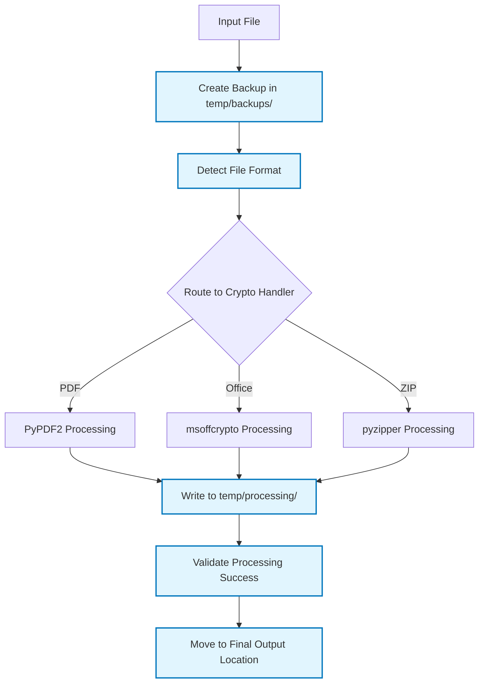

# FastPass - Core Business Logic Flow

This document focuses on the essential file processing workflow - how files are handled, where they're copied, and how final output is created.

## High-Level Processing Flow

```mermaid
flowchart TD
    Start([User: fast_pass decrypt file1.pdf file2.docx -p "password"]) --> Parse[Parse CLI Arguments]
    Parse --> FileList[Build File Processing List]
    FileList --> TempSetup[Create Secure Temp Directory]
    TempSetup --> Backup[Create Backup Files]
    Backup --> Process[Process Each File Through Crypto Pipeline]
    Process --> Validate[Validate Processing Success]
    Validate --> FinalOutput[Move to Final Output Location]
    FinalOutput --> Cleanup[Cleanup Temp Files]
    Cleanup --> Complete([Processing Complete])
    
    classDef coreProcess fill:#e8f5e8,stroke:#4caf50,stroke-width:2px
    class Parse,FileList,TempSetup,Backup,Process,Validate,FinalOutput,Cleanup coreProcess
```

## File Processing Pipeline

### 1. File List Preparation

**Input Processing:**
```python
# From: fast_pass decrypt file1.pdf -p "pwd1" file2.docx -p "pwd2"
file_processing_list = [
    {'path': Path('file1.pdf'), 'password': 'pwd1', 'format': 'pdf'},
    {'path': Path('file2.docx'), 'password': 'pwd2', 'format': 'office'}
]
```

**Tool Assignment:**
```python
tool_mapping = {
    '.pdf': 'PyPDF2',
    '.docx': 'msoffcrypto', '.xlsx': 'msoffcrypto', '.pptx': 'msoffcrypto',
    '.zip': 'pyzipper', '.7z': 'pyzipper'
}
```

### 2. Temporary Directory Structure

**Directory Setup:**
```
/temp/FastPass_20250125_143022_1234/
├── backups/           # Original file backups
│   ├── file1_backup_20250125_143022.pdf
│   └── file2_backup_20250125_143022.docx
├── processing/        # Intermediate processing files
│   ├── file1_temp.pdf
│   └── file2_temp.docx
└── output/           # Final processed files before move
    ├── file1_decrypted.pdf
    └── file2_decrypted.docx
```

### 3. File Processing Workflow



### 4. Crypto Processing Details

#### PDF Processing (PyPDF2)
```python
def process_pdf_file(input_path, temp_output, password, operation):
    import PyPDF2
    
    if operation == 'decrypt':
        with open(input_path, 'rb') as input_file:
            reader = PyPDF2.PdfReader(input_file)
            if reader.is_encrypted:
                reader.decrypt(password)
            writer = PyPDF2.PdfWriter()
            for page in reader.pages:
                writer.add_page(page)
            with open(temp_output, 'wb') as output_file:
                writer.write(output_file)
    
    elif operation == 'encrypt':
        with open(input_path, 'rb') as input_file:
            reader = PyPDF2.PdfReader(input_file)
            writer = PyPDF2.PdfWriter()
            for page in reader.pages:
                writer.add_page(page)
            writer.encrypt(password)
            with open(temp_output, 'wb') as output_file:
                writer.write(output_file)
```

#### Office Document Processing (msoffcrypto)
```python
def process_office_file(input_path, temp_output, password, operation):
    import msoffcrypto
    
    with open(input_path, 'rb') as input_file:
        office_file = msoffcrypto.OfficeFile(input_file)
        
        if operation == 'decrypt':
            office_file.load_key(password=password)
            with open(temp_output, 'wb') as output_file:
                office_file.decrypt(output_file)
        
        elif operation == 'encrypt':
            office_file.encrypt(password=password, output_file=temp_output)
```

#### ZIP Processing (pyzipper)
```python
def process_zip_file(input_path, temp_output, password, operation):
    import pyzipper
    import zipfile
    
    if operation == 'decrypt':
        # Extract encrypted ZIP to unencrypted ZIP
        with pyzipper.AESZipFile(input_path) as encrypted_zf:
            encrypted_zf.setpassword(password.encode('utf-8'))
            with zipfile.ZipFile(temp_output, 'w') as unencrypted_zf:
                for file_info in encrypted_zf.infolist():
                    file_data = encrypted_zf.read(file_info.filename)
                    unencrypted_zf.writestr(file_info.filename, file_data)
    
    elif operation == 'encrypt':
        # Create encrypted ZIP from input files
        with pyzipper.AESZipFile(temp_output, 'w', compression=pyzipper.ZIP_DEFLATED) as zf:
            zf.setpassword(password.encode('utf-8'))
            zf.setencryption(pyzipper.WZ_AES, nbits=256)
            zf.write(input_path, input_path.name)
```

### 5. Output File Placement

#### In-Place Modification (Default)
```python
# Original: /documents/report.pdf
# Backup:   /temp/backups/report_backup_20250125_143022.pdf  
# Process:  /temp/processing/report_temp.pdf
# Final:    /documents/report.pdf (overwrites original)

final_path = original_file_path
shutil.move(temp_processed_file, final_path)
```

#### Output Directory Mode
```python
# Original: /documents/report.pdf
# Output:   /decrypted/report.pdf (original unchanged)

if args.output_dir:
    final_path = Path(args.output_dir) / processed_file_name
    final_path.parent.mkdir(parents=True, exist_ok=True)
    shutil.move(temp_processed_file, final_path)
```

#### Conflict Resolution
```python
# If target exists, append counter
if final_path.exists():
    stem = final_path.stem
    suffix = final_path.suffix
    counter = 1
    while final_path.exists():
        final_path = final_path.parent / f"{stem}_{counter:03d}{suffix}"
        counter += 1
```

### 6. File Tracking Throughout Process

```python
class FileTracker:
    def __init__(self):
        self.file_operations = []
    
    def track_file(self, original_path, operation):
        file_record = {
            'original_path': Path(original_path),
            'backup_path': None,
            'temp_path': None, 
            'final_path': None,
            'operation': operation,
            'status': 'pending',
            'crypto_tool': None
        }
        self.file_operations.append(file_record)
        return file_record
    
    def update_paths(self, record, backup_path=None, temp_path=None, final_path=None):
        if backup_path:
            record['backup_path'] = Path(backup_path)
        if temp_path:
            record['temp_path'] = Path(temp_path)
        if final_path:
            record['final_path'] = Path(final_path)
```

### 7. Batch Processing Flow


### 8. Results and Cleanup

**Success Case:**
```python
# All files processed successfully
final_results = {
    'total_files': 3,
    'successful': 3,
    'failed': 0,
    'output_files': [
        '/documents/report.pdf',
        '/documents/spreadsheet.xlsx',
        '/documents/archive.zip'
    ]
}

# Cleanup: Remove temp directory and backups (if successful)
shutil.rmtree(temp_working_dir)
```

**Partial Failure Case:**
```python
# Some files failed processing
final_results = {
    'total_files': 3,
    'successful': 2,
    'failed': 1,
    'successful_files': ['/documents/report.pdf', '/documents/archive.zip'],
    'failed_files': [{'file': '/documents/spreadsheet.xlsx', 'error': 'Wrong password'}],
    'backups_retained': ['/temp/backups/spreadsheet_backup_20250125_143022.xlsx']
}

# Cleanup: Remove temp directory but keep backups for failed files
```

## Key Design Principles

1. **File Isolation**: All processing happens in secure temporary directories
2. **Backup First**: Always create backups before any modification
3. **Atomic Operations**: Each file is processed completely or not at all
4. **Progress Continuation**: Failures on one file don't stop processing of others
5. **Clean Recovery**: Failed operations can be rolled back using backups
6. **Predictable Output**: Output file locations follow consistent patterns
7. **Resource Cleanup**: Temporary files are always cleaned up after processing

This workflow ensures data safety while providing efficient batch processing of mixed file types with individual password handling.