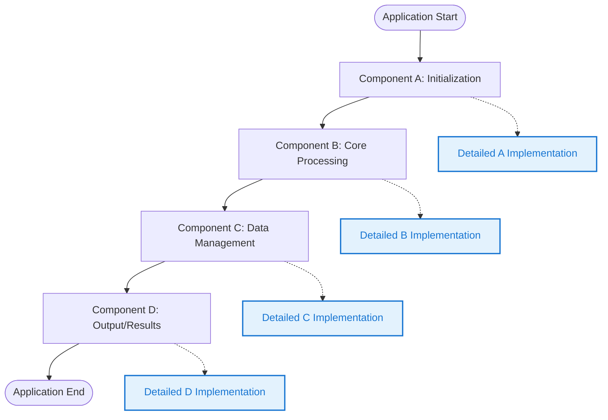
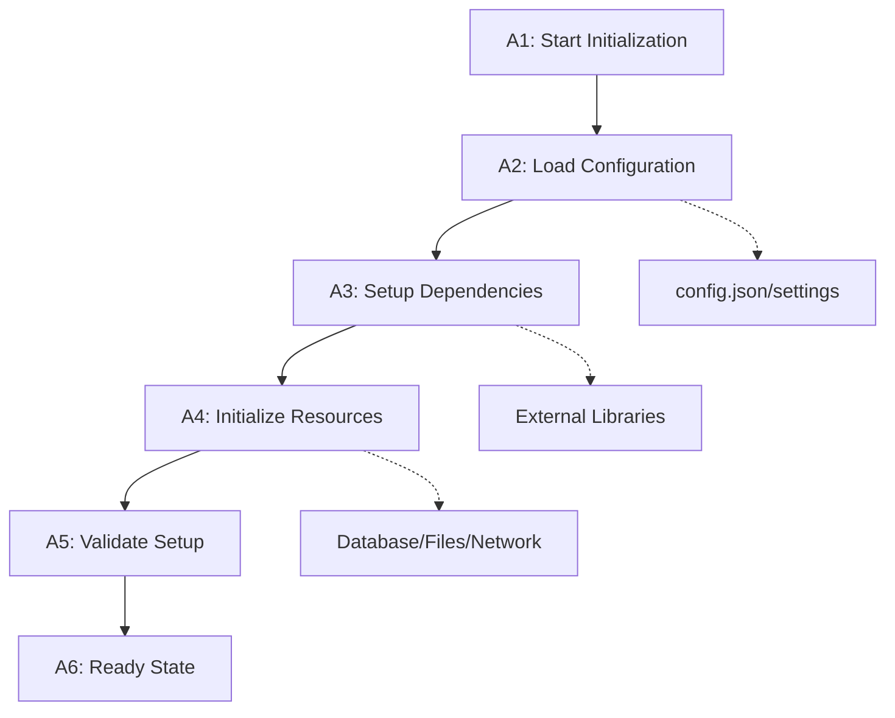
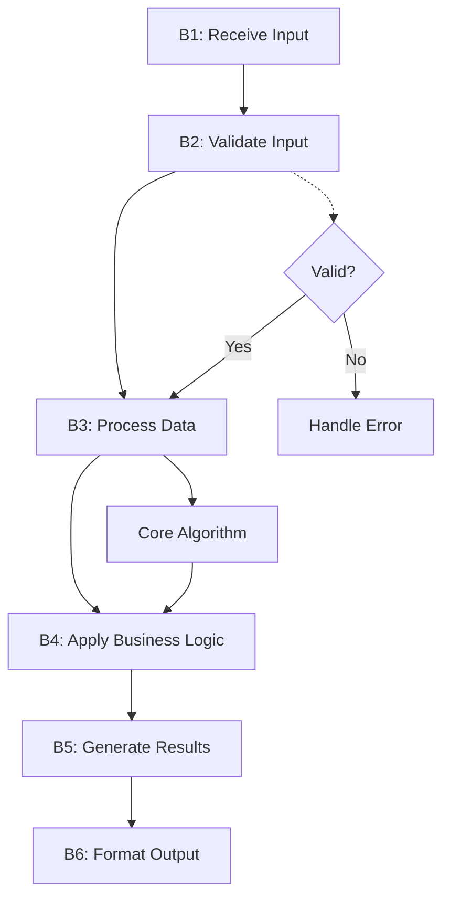
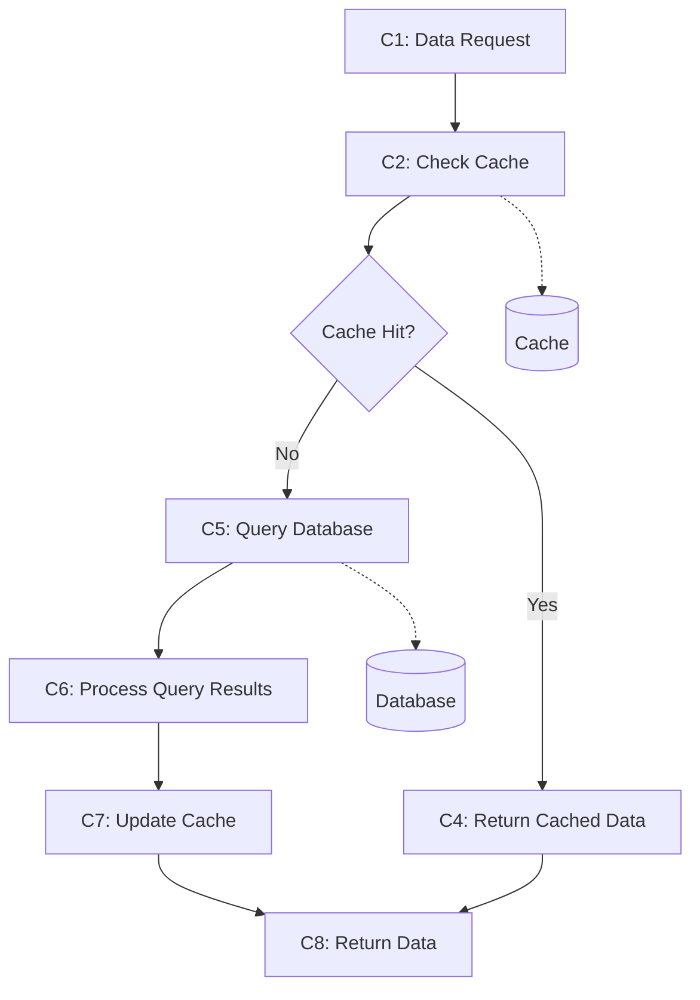
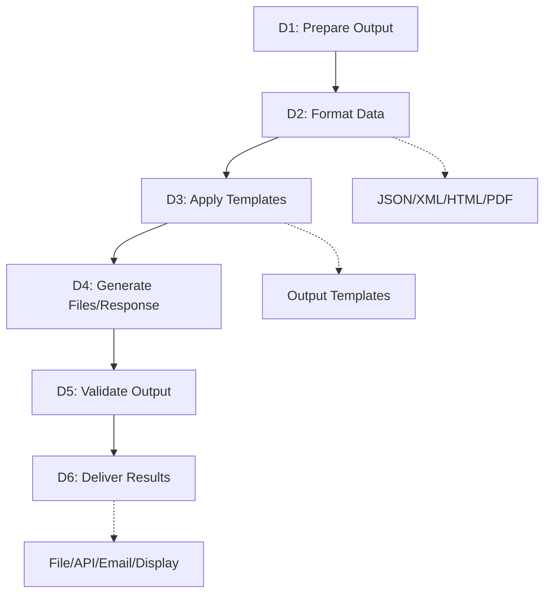

# [PROJECT NAME] - Complete Project Specification

> **Template Usage Instructions:**
> - Replace [PROJECT NAME] with your actual project name throughout
> - Fill in all bracketed placeholders with your project-specific information  
> - Customize the feature lists, test specifications, and diagrams for your use case
> - Use this as a comprehensive planning document before starting development

## Project Mission & Purpose

**[PROJECT NAME]** is a [brief description of what the application does]. It [main value proposition and key functionality]. The application [target audience and primary use cases].

**Core Problem Solved:** [What specific problem does this solve for users?]

**Key Differentiator:** [What makes this unique or better than alternatives?]

---

---

## Product Requirements Document (PRD)

### Project Overview

- **Project Name:** [PROJECT NAME]
- **Version:** [e.g., v1.0]
- **Target Platform:** [e.g., Web, Desktop, Mobile, CLI]
- **Technology Stack:** [e.g., Python, React, Node.js, etc.]
- **Timeline:** [Expected development timeline]
- **Team Size:** [Number of developers]

### Target Users

- **Primary Users:** [Who will use this primarily?]
- **Secondary Users:** [Any secondary user groups?]
- **User Experience Level:** [Beginner, Intermediate, Expert]
- **Use Cases:** [Top 3-5 use cases]

### Feature Specifications

#### Core Functionality
- [ ] [Core Feature 1]
- [ ] [Core Feature 2]
- [ ] [Core Feature 3]
- [ ] [Core Feature 4]
- [ ] [Core Feature 5]

#### User Interface
- [ ] [UI Feature 1]
- [ ] [UI Feature 2]
- [ ] [UI Feature 3]
- [ ] [UI Feature 4]
- [ ] [UI Feature 5]

#### Data Management
- [ ] [Data Feature 1]
- [ ] [Data Feature 2]
- [ ] [Data Feature 3]
- [ ] [Data Feature 4]
- [ ] [Data Feature 5]

#### Security & Authentication
- [ ] [Security Feature 1]
- [ ] [Security Feature 2]
- [ ] [Security Feature 3]
- [ ] [Security Feature 4]

#### Integration & APIs
- [ ] [Integration Feature 1]
- [ ] [Integration Feature 2]
- [ ] [Integration Feature 3]
- [ ] [Integration Feature 4]

#### Performance & Optimization
- [ ] [Performance Feature 1]
- [ ] [Performance Feature 2]
- [ ] [Performance Feature 3]
- [ ] [Performance Feature 4]

### Success Metrics

- **Performance Targets:** [e.g., Load time < 2 seconds]
- **User Experience:** [e.g., Task completion rate > 90%]
- **Reliability:** [e.g., 99.9% uptime]
- **Business Metrics:** [e.g., User adoption rate]

### Constraints & Assumptions

- **Technical Constraints:** [Any technical limitations]
- **Business Constraints:** [Budget, timeline, resources]
- **User Constraints:** [User environment limitations]
- **Assumptions:** [Key assumptions being made]

---

## [Interface/Command] Reference

```
[If CLI Application, include command reference]
Usage: [command] [options] [arguments]

Options:
  -h, --help              Show this help message
  -v, --version          Show version information
  [Add your specific options and arguments here]

Examples:
  [command] [example 1]     [Description of what this does]
  [command] [example 2]     [Description of what this does]

[If Web/Desktop Application, include:]
Navigation:
  [Menu Item 1]            [Description of functionality]
  [Menu Item 2]            [Description of functionality]
  
Key Features:
  [Feature 1]              [How to access and use]
  [Feature 2]              [How to access and use]
```

---

## Comprehensive Test Specifications

**Testing Strategy:** [Describe your overall testing approach]

| Status | Test Case | Command | Description | Input/Setup | Expected Output/Outcome |
|--------|-----------|---------|-------------|-------------|-------------------------|
| [ ] | **[test_001_basic_functionality]** | `[command] [flags] [inputs]` | [Description of what this test validates] | [Required files, environment setup] | [Exit codes, outputs, expected results] |
| [ ] | **[test_002_input_validation]** | `[command] [flags] [inputs]` | [Description of input validation test] | [Test files, invalid inputs] | [Error messages, exit codes] |
| [ ] | **[test_003_security_validation]** | `[command] [flags] [inputs]` | [Description of security test] | [Security test scenarios, malicious inputs] | [Security responses, sanitized errors] |
| [ ] | **[test_004_performance_test]** | `[command] [flags] [inputs]` | [Description of performance test] | [Large files, stress conditions] | [Performance metrics, completion times] |
| [ ] | **[test_005_error_handling]** | `[command] [flags] [inputs]` | [Description of error handling test] | [Error conditions, invalid states] | [Graceful failures, error messages] |
| [ ] | **[test_006_integration_test]** | `[command] [flags] [inputs]` | [Description of integration test] | [Multiple components, end-to-end scenarios] | [Complete workflows, final outputs] |
| [ ] | **[test_007_edge_cases]** | `[command] [flags] [inputs]` | [Description of edge case test] | [Boundary conditions, unusual inputs] | [Robust handling, edge case results] |
| [ ] | **[test_008_compatibility]** | `[command] [flags] [inputs]` | [Description of compatibility test] | [Different environments, versions] | [Cross-platform functionality] |
| [ ] | **[test_009_data_processing]** | `[command] [flags] [inputs]` | [Description of data processing test] | [Sample data, processing scenarios] | [Correct data transformation] |
| [ ] | **[test_010_cleanup_validation]** | `[command] [flags] [inputs]` | [Description of cleanup test] | [Resource allocation scenarios] | [Proper resource cleanup] |

---

## High-Level Architecture Overview

> 💡 This diagram shows the overall system architecture and main components of [PROJECT NAME].



---

## Section A: Component Initialization

> [Description of what happens during initialization phase]



**What's Actually Happening:**
- **A2: [Command Line Processing Phase]**
  - `[variable_name]` contains the raw command input from user
  - `[parser_object]` processes command line arguments using [parsing_library]
  - `[args.input_files]` becomes `[list_of_files]` (specific data structure)
  - `[args.output_format]` becomes `[format_specification]` (default or user-specified)
  - `[configuration_dict]` stores all user preferences and system settings
  - Error handling: if invalid arguments, `[exit_function](error_code)` with descriptive message

- **A3: [Configuration & Defaults Setup]**
  - `[self.config['setting_name']]` = `[default_value]` (specific configuration values)
  - `[self.config['processing_mode']]` = `[mode_specification]` (how application will process data)
  - `[self.config['output_template']]` = `[template_string]` (naming and formatting rules)
  - All boolean flags stored as actual Python `True/False`, not strings
  - Configuration validation: check for conflicting settings, invalid combinations

- **A4: [Logging & Debug System Setup]**
  - `[logging.basicConfig()]` with `[level=logging.DEBUG]` if debug mode enabled
  - Log format: `[timestamp_format] - [level] - [message_format]`
  - Handler target: `[log_destination]` (file, console, or both)
  - First log entry: `[application_name] starting - version [version_number]`
  - Memory logger: `[self.operation_log] = []` for runtime reference and debugging

- **A5: [Environment & Platform Validation]**
  - `[platform.system()]` must return `[expected_platform]` for compatibility
  - Check for required dependencies: `[import_statements]` for critical libraries
  - Test basic functionality: `[test_operation]` to verify core capabilities work
  - If validation fails: `[sys.exit(error_code)]` with "[error_message]"
  - Set `[self.platform_validated] = True` flag for later reference

- **A6: [Main Application Object Creation]**
  - Main `[ApplicationClass(args)]` object created with all parsed arguments
  - `[self.input_data]` = normalized and validated input sources
  - `[self.processing_pipeline]` = empty, will be configured based on input types
  - `[self.temp_resources]` = `[]` (tracking for cleanup)
  - `[self.external_connections]` = `None` (will hold external service references)
  - `[self.operation_start_time]` = `[datetime.now()]` for timing and performance metrics
  - State flag: `[self.ready_for_processing] = True`

---

## Section B: Core Processing Logic

> [Description of the main processing logic]



**What's Actually Happening:**
- **B2: [Input Validation & Path Resolution]**
  - For each input in `[args.input_files]`:
  - `[os.path.expanduser()]` converts `~` to actual user directory path
  - `[os.path.abspath()]` converts relative paths to full absolute paths
  - `[os.path.normpath()]` fixes mixed slashes and resolves `../` patterns
  - `[os.path.exists()]` returns `True/False` - if `False`, add to `[missing_files[]]` list
  - `[os.path.isfile()]` confirms it's a file, not a directory
  - Store results in `[self.validated_inputs] = {'valid': [], 'invalid': []}` with full paths
  - If any validation fails: `[sys.exit(error_code)]` with "[specific_error_message]"

- **B3: [Security Validation & Attack Prevention]**
  - For each validated path, run `[os.path.realpath()]` to resolve symlinks
  - Check for path traversal: split path and look for `[dangerous_patterns]` components
  - Forbidden patterns: `[security_blacklist] = ['../..', 'system_dirs', 'sensitive_paths']`
  - Use `[pathlib.Path(file).resolve()]` to get canonical path
  - Compare against allowed directories: `[allowed_paths] = [user_home, current_dir, temp_dirs]`
  - If security violation: set `[security_violation] = True`, log attempt, `[sys.exit(security_code)]`
  - Generate sanitized error: remove sensitive paths, show safe generic message

- **B4: [File Type & Format Validation]**
  - Extract extension: `[file_ext] = [os.path.splitext(filename)[1].lower()]`
  - Allowed extensions: `[ALLOWED_EXTENSIONS] = ['.ext1', '.ext2', '.ext3']`
  - Validation check: `[if file_ext not in ALLOWED_EXTENSIONS:]`
  - If invalid: `[rejected_files.append(filename)]`, continue processing other files
  - Store file types: `[self.file_types] = {'file1.ext': 'type1', 'file2.ext': 'type2'}`
  - Special handling: certain extensions get `[special_processing_flag] = True`

- **B5: [Content Verification & Magic Number Check]**
  - Import validation library: `[import magic_library]`
  - For each file: `[mime_type] = [magic.from_file(filepath, mime=True)]`
  - Expected MIME types: `[expected_mimes] = {'ext1': 'mime/type1', 'ext2': 'mime/type2'}`
  - Compare actual vs expected: `[if actual_mime != expected_mime:]`
  - Read file header: `[with open(file, 'rb') as f: header = f.read(8)]`
  - Magic signatures: specific byte patterns that identify real file types
  - If mismatch: `[file_validation_errors.append({'file': filename, 'error': 'content_mismatch'})]`

- **B6: [Access Testing & Permission Validation]**
  - For each validated file: `[test_handle] = [open(filepath, 'rb')]`
  - Try reading sample: `[sample_data] = [test_handle.read(1024)]`
  - Check file size: `[file_size] = [os.path.getsize(filepath)]`
  - Size validation: if `[file_size] == 0` or `[file_size] > [MAX_SIZE]`: flag as invalid
  - Test destination access: `[os.access(destination_dir, os.W_OK)]`
  - Close handles: `[test_handle.close()]` to prevent resource leaks
  - Store metadata: `[self.file_metadata[filename]] = {'size': size, 'accessible': bool, 'verified': bool}`

- **Error Handling & Information Security:**
  - All errors filtered through `[sanitize_error_message()]` function
  - Remove sensitive information: replace `[sensitive_paths]` with `[safe_placeholders]`
  - Truncate long messages: if `[len(message)] > [MAX_LENGTH]`, show truncated version
  - Log full details to debug log, show sanitized version to user
  - Exit codes: `[0]` = success, `[1]` = security violation, `[2]` = invalid input, `[3]` = access denied
  - Global state: `[self.validation_errors] = {'security': [], 'format': [], 'access': []}`

---

## Section C: Data Management

> [Description of how data is managed in the system]



**What's Actually Happening:**
- **C1: [Data Processing & Business Logic Phase]**
  - `[input_data]` analyzed to determine processing requirements
  - `[processing_strategy]` selected based on data type and size
  - `[self.processing_queue] = []` initialized for batch operations
  - Data validation: check integrity, format consistency, required fields
  - `[processing_context] = {'mode': str, 'batch_size': int, 'timeout': int}`

- **C2: [Core Algorithm Execution]**
  - Main processing loop: `[for item in validated_inputs:]`
  - Algorithm implementation: `[result] = [core_algorithm(input_data, parameters)]`
  - Progress tracking: `[processed_count] += 1`, `[completion_percentage] = [calculation]`
  - Error handling: catch exceptions, log errors, continue or abort based on severity
  - Intermediate results stored in `[self.processing_results] = []`

- **C3: [External Service Integration]**
  - Service connections: `[external_api] = [connect_to_service(credentials)]`
  - API calls: `[response] = [external_api.process(data, options)]`
  - Response validation: check status codes, parse response data
  - Rate limiting: implement delays, retry logic for failed requests
  - Store service responses: `[self.external_results] = {'service_name': response_data}`

- **C4: [Data Transformation & Formatting]**
  - Transform raw results: `[formatted_data] = [transform_function(raw_data)]`
  - Apply business rules: validate against requirements, apply calculations
  - Data enrichment: add metadata, timestamps, processing information
  - Quality checks: verify output meets specifications
  - Final formatting: `[output_format] = [apply_template(processed_data, template)]`

---

## Section D: Output & Results

> [Description of how results are generated and delivered]



**What's Actually Happening:**
- **D1: [Output Generation & Formatting]**
  - Analyze processing results: `[final_results] = [self.processing_results]`
  - Determine output formats: `[output_specs] = [parse_output_requirements(args)]`
  - Create output structure: `[output_data] = {'format': str, 'content': data, 'metadata': dict}`
  - Apply formatting rules: templates, styling, structure requirements
  - Validate output completeness: ensure all required data present

- **D2: [File Creation & Destination Management]**
  - Generate output filenames: `[filename] = [create_filename(template, timestamp, input_names)]`
  - Prepare destination: `[os.makedirs(output_directory, exist_ok=True)]`
  - Write files: `[with open(output_path, 'w') as f: f.write(formatted_content)]`
  - Set file permissions: `[os.chmod(output_file, permissions)]`
  - Create file manifest: `[self.output_files] = [{'path': str, 'size': int, 'created': datetime}]`

- **D3: [Quality Assurance & Validation]**
  - Output validation: check file integrity, size, format correctness
  - Content verification: `[verify_output_content(output_file, expected_structure)]`
  - Cross-reference checks: ensure output matches input requirements
  - Generate checksums: `[file_hash] = [calculate_checksum(output_file)]`
  - Validation results: `[self.validation_status] = {'passed': bool, 'errors': list}`

- **D4: [Delivery & User Notification]**
  - Prepare delivery: copy files to final destinations, create archives if needed
  - Generate summary report: `[summary] = [create_summary(processing_stats, output_info)]`
  - User notification: display completion message, file locations, next steps
  - Cleanup preparation: mark temporary files for deletion
  - Set completion flag: `[self.processing_complete] = True`

---

## Section E: [Additional Component]

> [Add more sections as needed for your specific project]

> **Template Note:** Add additional sections (E, F, G, etc.) as needed for your project's complexity. Each section should focus on a specific component or process flow.

---

## Technical Implementation Summary

This specification provides a comprehensive blueprint for [PROJECT NAME] development. The document includes:

✓ **Complete PRD** with feature checklists and success metrics  
✓ **Detailed test specifications** covering all functionality areas  
✓ **Technical architecture diagrams** with implementation details  
✓ **Command/interface reference** for user guidance  
✓ **Component-level flow diagrams** for development guidance  

This document contains enough context and detail for a development team to implement [PROJECT NAME] while maintaining consistency with the planned architecture and feature set. The specification serves as both a planning document and a reference for ongoing development.

**Development Notes:**
- Follow the PRD feature checklist for development priority
- Implement test cases in parallel with feature development
- Use the technical diagrams as implementation guides
- Refer to this document for architecture decisions
- Update this specification as requirements evolve